# Aquaculture Machine Learning Pipeline Architecture

## Table of Contents
1. [Project Overview](#1-project-overview)
2. [Complete Execution Flow](#2-complete-execution-flow)
3. [Training Data](#3-training-data)
4. [Cross Validation](#4-cross-validation)
5. [Observation Process](#5-observation-process)
6. [Training Observation Generation](#6-training-observation-generation)
7. [Validation Pipeline](#7-validation-pipeline)
8. [Feature Engineering](#8-feature-engineering)
9. [Feature Matrix](#9-feature-matrix)
10. [Model Training](#10-model-training)
11. [Hyperparameter Optimization](#11-hyperparameter-optimization)
12. [Competition Metric](#12-competition-metric)
13. [Final Model Training](#13-final-model-training)
14. [Saved Artifacts](#14-saved-artifacts)
15. [Inference Pipeline](#15-inference-pipeline)
16. [Training vs Validation vs Test](#16-training-vs-validation-vs-test)
17. [Reproducibility](#17-reproducibility)
18. [Configuration](#18-configuration)
19. [Performance Considerations](#19-performance-considerations)
20. [Future Improvements](#20-future-improvements)

## 1. Project Overview

### Repository Organization

The aquaculture machine learning framework follows a modular structure:

```
geoai_aquaculture/
├── aquaculture/                 # Core feature engineering module
│   ├── __init__.py
│   ├── config.py               # AquacultureConfig dataclass
│   ├── feature_engineering.py  # Main feature engineering transformer
│   ├── indices.py              # Spectral index calculations
│   ├── masking.py              # Cloud masking and contamination simulation
│   └── temporal.py             # Temporal statistics computation
├── src/                         # Training and inference framework
│   ├── __init__.py
│   ├── config.py               # TrainingConfig dataclass
│   ├── trainer.py              # Main Trainer class orchestrating pipeline
│   ├── model_factory.py        # Model creation with class weighting
│   ├── optuna_utils.py         # Hyperparameter optimization utilities with CV
│   ├── evaluate.py             # Model evaluation and cross-validation
│   ├── metrics.py              # Competition score and metrics calculation
│   ├── inference.py            # Inference pipeline for predictions
│   ├── plotting.py             # Visualization functions
│   └── io.py                   # Input/output utilities
├── data/                        # Data storage (not tracked in git)
├── experiments/                 # Experiment outputs
├── models/                      # Saved models
├── notebooks/                   # Jupyter notebooks
├── spatial_blocks/              # Spatial blocking utilities
├── tests/                       # Unit tests
├── requirements.txt             # Python dependencies
└── docs/                        # Documentation
    └── architecture/
        └── training_pipeline.md # Detailed pipeline architecture documentation
└── README.md                    # Project overview
```

### Module Responsibilities

| Module | Responsibility |
|--------|----------------|
| `aquaculture.feature_engineering` | Feature extraction from raw satellite timesteps |
| `aquaculture.indices` | Spectral index calculations (NDVI, NDWI, etc.) |
| `aquaculture.masking` | Cloud masking simulation and window selection |
| `aquaculture.temporal` | Temporal statistics computation (mean, std, trend) |
| `src.config` | Training configuration management |
| `src.trainer` | Main orchestrates the complete pipeline |
| `src.model_factory` | Model factory for LightGBM, CatBoost, XGBoost with class weighting |
| `src.optuna_utils` | Hyperparameter optimization using Optuna with Stratified K-Fold CV |
| `src.evaluate` | Cross-validation and model evaluation |
| `src.metrics` | Competition score (0.6*F1 + 0.4*ROC-AUC) calculation |
| `src.inference` | Prediction pipeline for test data |
| `src.io` | Model, configuration, and artifact persistence |
| `src.plotting` | Visualization functions for analysis |

### Dependency Diagram

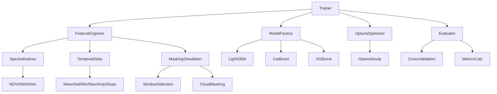

## 2. Complete Execution Flow

### High-Level Flowchart

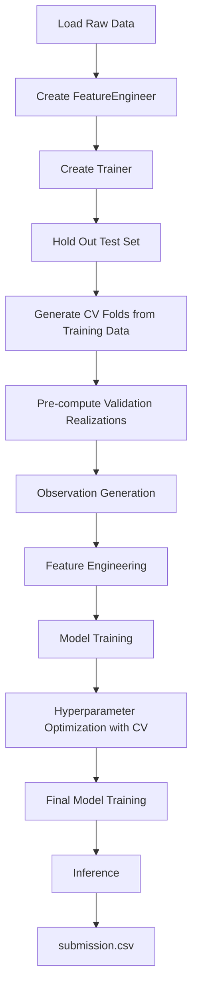

### Stage-by-Stage Description

#### 2.1 Load Raw Data
- Raw data consists of multi-temporal Sentinel-1 SAR and Sentinel-2 multispectral imagery
- Shape: `(n_samples, 12 time steps, 12 bands)` or flattened `(n_samples, 144)`
- Band order: [0:VH, 1:VV, 2:blue, 3:green, 4:nir, 5:nira, 6:re1, 7:re2, 8:re3, 9:red, 10:swir1, 11:swir2]
- Implemented in: `trainer.py:_prepare_data()` lines 121-193

#### 2.2 Create FeatureEngineer
- Instantiates `AquacultureFeatureEngineer` with configuration from `TrainingConfig`
- Configuration includes masking simulation, feature inclusion flags, and random state
- Implemented in: `trainer.py:_prepare_data()` lines 166-179

#### 2.3 Create Trainer
- Main orchestrator that coordinates all pipeline components
- Initializes random seeds for reproducibility
- Creates experiment directory for artifact storage
- Implemented in: `trainer.py:__init__()` lines 47-71

#### 2.4 Hold Out Test Set
- Separates test set (held out for final evaluation) before any processing
- Uses `TrainingConfig.test_size` (default: 0.2) to hold out test set
- Remaining data (1 - test_size) used for CV and hyperparameter tuning
- Implemented in: `trainer.py:fit()` lines 301-307

#### 2.5 Generate CV Folds
- Uses `StratifiedKFold` from scikit-learn with shuffling
- Number of splits defined by `TrainingConfig.n_splits` (default: 5)
- Random state controlled by `TrainingConfig.random_seed`
- Applied to training data only (after test set held out)
- Implemented in: `optuna_utils.py:create_objective_function()` lines 165-171

#### 2.6 Pre-compute Validation Realizations
- Generates fixed validation realizations for each CV fold BEFORE Optuna begins
- Ensures validation data is consistent across all trials for fair comparison
- Number of realizations controlled by `TrainingConfig.n_validation_realizations` (default: 1)
- Implemented in: `trainer.py:_generate_validation_realizations_for_fold()` lines 346-422

#### 2.7 Observation Generation
- Simulates partial observations through window selection and cloud masking
- **Training folds**: Stochastic window selection (4-6 months) + monthly S2 band dropout (NEW realization per trial)
- **Validation folds**: Fixed window selection (pre-computed realizations, same across trials)
- **Test set**: Deterministic processing (fixed seed ensures reproducible stochastic simulation of observation constraints)
- Implemented in: `masking.py:apply_competition_mask()` lines 191-248

#### 2.8 Feature Engineering
- Transforms raw satellite data into engineered features
- Computes spectral indices, SAR features, cross-sensor features
- Calculates temporal statistics and metadata features
- Implemented in: `feature_engineering.py:transform()` lines 250-557

#### 2.9 Model Training
- Trains base models (LightGBM/CatBoost/XGBoost) on engineered features
- Uses class weighting to handle imbalance via `scale_pos_weight`
- No early stopping during Optuna (uses full n_estimators)
- Implemented in: `model_factory.py:create()` lines 55-126

#### 2.10 Hyperparameter Optimization with CV
- Uses Optuna to optimize hyperparameters with Stratified K-Fold CV
- Maximizes competition score (0.6*F1 + 0.4*ROC-AUC)
- Each trial evaluates model using CV with:
  - Training folds: New stochastic realization per trial
  - Validation folds: Fixed realizations (pre-computed)
- Supports pruning of unpromising trials
- Implemented in: `optuna_utils.py:optimize_hyperparameters()` lines 257-328

#### 2.11 Final Model Training
- Trains final model on ALL training data (everything except held-out test set)
- Uses best hyperparameters from Optuna optimization
- Feature engineering with `training=True` (fresh realizations)
- No validation set used, so early stopping disabled
- Implemented in: `trainer.py:fit()` lines 536-550

#### 2.12 Inference
- Loads trained model and feature engineering pipeline
- Transforms test data using fixed parameters (deterministic processing)
- Generates probability predictions and binary classifications
- Creates submission.csv in required format
- Implemented in: `inference.py:InferencePipeline.predict_proba()` lines 90-121

#### 2.13 submission.csv
- Contains three columns: `id`, `prediction`, `probability`
- `id`: Sample identifier from test dataset
- `prediction`: Binary class (0 or 1) using threshold 0.5
- `probability`: Probability of positive class (aquaculture)
- Implemented in: `inference.py:InferencePipeline.create_submission()` lines 177-210

## 3. Training Data

### Data Loading Location
- Data loading occurs in user code before calling `Trainer.fit()`
- Trainer expects pre-loaded NumPy arrays
- Implemented in: `trainer.py:fit()` lines 301-307 (hold out test set)

### Expected Input Format
Two accepted formats:
1. 3D array: `(n_samples, 12 time steps, 12 bands)` 
2. 2D array: `(n_samples, 144)` representing flattened 3D data

Band ordering (consistent in both formats):
```
0: VH (VH polarization)
1: VV (VV polarization)
2: blue (Sentinel-2 B02)
3: green (Sentinel-2 B03)
4: nir (Sentinel-2 B08)
5: nira (Sentinel-2 B8A)
6: re1 (Sentinel-2 B05)
7: re2 (Sentinel-2 B06)
8: re3 (Sentinel-2 B07)
9: red (Sentinel-2 B04)
10: swir1 (Sentinel-2 B11)
11: swir2 (Sentinel-2 B12)
```

Implemented in: `trainer.py:_prepare_data()` lines 142-157

### Tensor Dimensions
- **Input**: `(n_samples, 12, 12)` or `(n_samples, 144)`
- **After feature engineering**: `(n_samples, n_engineered_features)`
- **Feature count**: Variable based on configuration (typically 100-300+ features)

### Feature Ordering
Features are generated in deterministic order:
1. Optical indices (NDVI, NDWI, MNDWI, NDMI, NDRE2, NDRE3) × 12 months
2. Optical bands (green, nir, nira, swir1, swir2) × 12 months  
3. SAR features (VH, VV, VH_VV_ratio, VH_VV_diff) × 12 months
4. Cross-sensor features (if enabled) × 12 months
5. Temporal statistics (mean, std, min, max, amplitude, slope) × all features
6. Metadata features (window_length, start_month, end_month, n_optical_obs, fraction_optical, monthly_obs_flags)

Implemented in: `feature_engineering.py:_build_feature_names()` lines 200-248

### Labels
- Binary classification: 0 (non-aquaculture), 1 (aquaculture)
- Shape: `(n_samples,)`
- Expected to be balanced or slightly imbalanced
- Handled via class weighting in model factory

### Missing Value Representation
- Missing/cloud-masked values represented as `-9999.0`
- Converted to `np.nan` for internal processing
- Temporal statistics ignore NaN values for all features:
  - Both SAR and optical features: NaN values ignored in calculations
  - Statistics computed only over observed/unmasked months
- Implemented in: `feature_engineering.py:transform()` lines 323-324 and `temporal.py` functions

## 4. Cross Validation

### Strategy
- Uses `StratifiedKFold` with shuffling to maintain class distribution
- Number of folds: `TrainingConfig.n_splits` (default: 5)
- Random state: `TrainingConfig.random_seed` for reproducibility
- Applied to training data only (after test set held out)

### Implementation Details
```python
skf = StratifiedKFold(n_splits=n_splits, shuffle=True, random_state=random_state)
for fold_idx, (train_idx, val_idx) in skf.split(X_train, y_train):
    # Process fold
```

Located in: `optuna_utils.py:create_objective_function()` lines 165-171

### Fold Generation Process
For each fold:
1. Training indices: ~80% of training data (stratified)
2. Validation indices: ~20% of training data (stratified)
3. Indices are shuffled before splitting to prevent ordering bias

### Example Fold Split (Conceptual)
With 80 training samples and 5 folds:
- **Fold 0**: Train=[0-12,16-28,32-44,48-60,64-76], Val=[13-15,29-31,43-47,61-63,77-79]
- **Fold 1**: Train=[0-3,13-15,29-31,43-47,61-63,77-79], Val=[4-12,16-28,32-44,48-60,64-76]
- ...and so on for all 5 folds

### Reproducibility
- Controlled by `TrainingConfig.random_seed`
- Ensures identical fold splits across runs
- Verified by setting seed before `StratifiedKFold` initialization

## 5. Observation Process

### Purpose
The observation process simulates real-world satellite data limitations:
- Cloud contamination affecting Sentinel-2 optical bands
- Temporal gaps due to satellite revisit patterns
- SAR data unaffected by clouds (always available)

This differs from traditional data augmentation as it:
1. Mimics actual data collection constraints
2. Creates realistic missing data patterns
3. Preserves temporal correlations within observation windows
4. Applies different masking strategies to SAR vs optical bands

### Implementation Process

For each sample during training (`training=True` in `feature_engineer.transform()`):

#### 5.1 Window Selection
- Choose window length: 4, 5, or 6 months
- Probabilities: `window_length_probs` (default: [1/3, 1/3, 1/3])
- Choose start month: 0-11 (Jan-Dec)
- If `start_month_distribution` provided, use categorical distribution
- Otherwise, uniform distribution over valid start months (0 to 12-window_length)

Implemented in:
- `masking.py:select_window_length()` lines 53-78
- `masking.py:select_start_month()` lines 81-123

#### 5.2 Sentinel-2 Masking
- For months OUTSIDE selected window: ALL bands set to -9999 (missing)
- For months INSIDE window: 
  - SAR bands (VH, VV indices 0,1): Always preserved
  - S2 bands (indices 2-11): Subject to monthly dropout
- Monthly dropout probabilities: `s2_monthly_dropout` (12 values, 0-1)
- For each window month:
    - Sample uniform random [0,1)
    - If < dropout probability: set ALL S2 bands to -9999 (masked)
    - Else: preserve ALL S2 bands' original values

Implemented in:
- `feature_engineering.py:transform()` lines 276-322 (main loop)
- `masking.py:create_s2_mask()` lines 126-189
- `masking.py:apply_s2_masking()` lines 192-235

#### 5.3 Sentinel-1 Handling
- SAR bands (indices 0,1) are NEVER masked
- Always retain original values regardless of window or dropout
- Reflects SAR's all-weather capability

#### Sequence Diagram: Single Sample Transformation

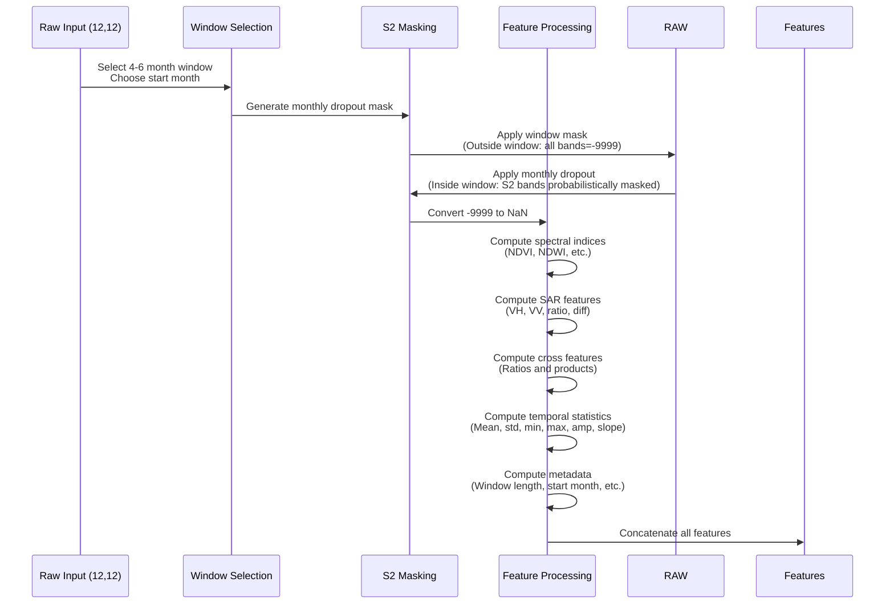

## 6. Training Observation Generation

### Observation Generation Mechanics

During training, each raw sample can generate multiple observations through stochastic processes:

#### 6.1 Observation Sources
1. **Original record**: Single deterministic view (when `training=False`)
2. **Optuna trials**: Each trial sees different observations for TRAINING folds
3. **Cross-validation folds**: Each fold uses different data splits
4. **Validation realizations**: Multiple stochastic views for VALIDATION folds (fixed across trials)

#### 6.2 Observation Generation Flow

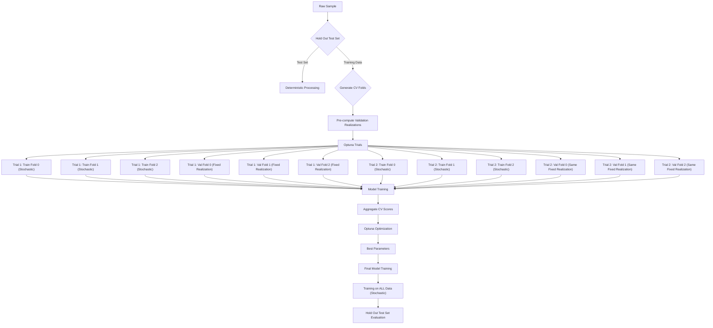

### Observation Regeneration Timing

Observations are regenerated at these specific points:

#### 6.2.1 During Optuna Optimization (TRAINING FOLDS)
- **New observation per trial**: Each hyperparameter trial gets freshly generated observations for TRAINING data
- **Randomness source**: `TrainingConfig.random_seed + trial_number * 1000 + fold_number * 100`
- **Implementation**: `optuna_utils.py:create_objective_function()` lines 185-205
- **Regeneration frequency**: Every Optuna trial for each training fold

#### 6.2.2 During Optuna Optimization (VALIDATION FOLDS)
- **Fixed observations per fold**: Validation realizations are fixed within Optuna study
- **Purpose**: Ensures fair comparison between hyperparameter configurations
- **Implementation**: `trainer.py:_generate_validation_realizations_for_fold()` lines 346-422
- **Regeneration frequency**: Once per Optuna study (reused across trials and folds)

#### 6.2.3 During Final Training
- **New observation**: Uses fresh randomness different from Optuna phase
- **Randomness source**: `TrainingConfig.random_seed` (final training seed)
- **Implementation**: `trainer.py:fit()` lines 536-550
- **Regeneration frequency**: Once for final model training on all data

#### 6.2.4 During Test Set Evaluation
- **Deterministic processing**: Uses fixed parameters (no stochasticity)
- **Randomness source**: `TrainingConfig.random_seed` (same as final training)
- **Implementation**: `trainer.py:fit()` lines 552-554
- **Regeneration frequency**: Once for test set evaluation

### Unique Observation Count Calculation

For a single training record, maximum unique observations:

```
N_observations = 
    (n_trials × n_folds × n_training_realizations_per_fold) +  // Training: new per trial
    (n_folds × n_validation_realizations) +                   // Validation: fixed realizations
    1                                                          // Test: deterministic
```

With default settings:
- `n_trials` = 100
- `n_folds` = 5 (from cross-validation)
- `n_training_realizations_per_fold` = 1 (new per trial)
- `n_validation_realizations` = 1 or 5

**Minimum** (n_validation_realizations=1): 
(100 × 5 × 1) + (5 × 1) + 1 = 506 observations

**Maximum** (n_validation_realizations=5): 
(100 × 5 × 1) + (5 × 5) + 1 = 526 observations

### Random Seed Management

- **Optuna trials (training data)**: `base_seed + trial_id * 1000 + fold_id * 100` 
- **Validation realizations**: `base_seed + fold_id * 10000 + realization_id * 1000`
- **Final training**: `base_seed`
- **Test set**: `base_seed` (deterministic)
- Ensures no overlap in random sequences
- Implemented in: `trainer.py:_set_random_seeds()` lines 73-81 and usage throughout

## 7. Validation Pipeline

### Validation Observation Creation

Validation observations are created through a specialized process designed for fair hyperparameter comparison:

#### 7.1 Process Overview
1. Split data into train/test sets (80/20 stratified) - test set held out
2. From training data, generate CV folds using StratifiedKFold
3. For each validation fold, generate fixed validation realizations BEFORE Optuna begins
4. Use first realization for Optuna optimization (same across all trials)
5. Average score across all realizations for final CV reporting (if n_validation_realizations > 1)

#### 7.2 Implementation Details

```python
# In trainer.py:_generate_validation_realizations_for_fold()
for i in range(n_validation_realizations):
    # Create temporary feature engineer with specific seed
    temp_fe = AquacultureFeatureEngineer(
        simulate_mask=True,  # Always simulate for validation
        random_state=base_seed + fold_id * 10000 + i * 1000,
        # ... other config parameters
    )
    # Process validation data through this engineer
    X_realized = temp_fe.transform(X_val_raw, training=True)
    realizations.append((X_realized.values, y_val))
```

Located in: `trainer.py:_generate_validation_realizations_for_fold()` lines 346-422

### Fixed vs Regenerated Validation

#### Why Fixed During Optuna?
- Ensures fair comparison: All hyperparameter trials evaluated on same validation data
- Prevents noise in optimization from validation set variability
- Maintains statistical validity of optimization process
- Reduces computational overhead (compute once, reuse 100x)

#### Why Regenerated for Final Evaluation?
- Not applicable - validation realizations are used ONLY during Optuna
- Final evaluation uses hold-out test set, not validation set

#### Implementation Difference
- **Optuna phase**: Uses first validation realization only (`val_realizations[0][0]`) for consistency
- **CV Reporting**: Averages across all `n_validation_realizations` if > 1
- **Final evaluation**: Uses hold-out test set (separate from CV process)

Located in: `trainer.py:fit()` lines 480-485 (Optuna) and lines 515-520 (CV reporting)

### Design Rationale

This design was chosen to:
1. **Reduce optimization noise**: Fixed validation set prevents misleading gradient signals
2. **Enable efficient optimization**: Avoids re-computing validation features every trial
3. **Provide robust CV reporting**: Multiple realizations better estimate true CV performance
4. **Maintain computational efficiency**: Validation features computed once, reused 100x
5. **Preserve hold-out purity**: Test set completely untouched until final evaluation

## 8. Feature Engineering

### Feature Categories

The feature engineering process creates six distinct feature groups:

#### 8.1 SAR Features
**Features**: VH, VV, VH_VV_ratio, VH_VV_diff  
**Temporal resolution**: Monthly (12 months)  
**Mathematical definitions**:
- VH_VV_ratio = VH / VV (with division by zero protection → NaN)
- VH_VV_diff = VH - VV

**Motivation**: Captures radar backscatter characteristics sensitive to water surface roughness and vegetation structure  
**Implementation**: `feature_engineering.py:transform()` lines 362-373

#### 8.2 Optical Indices
**Features**: NDVI, NDWI, MNDWI, NDMI, NDRE2, NDRE3  
**Temporal resolution**: Monthly (12 months)  
**Mathematical definitions**:
- NDVI = (NIR - Red) / (NIR + Red)
- NDWI = (Green - NIR) / (Green + NIR)  
- MNDWI = (Green - SWIR1) / (Green + SWIR1)
- NDMI = (NIR - SWIR1) / (NIR + SWIR1)
- NDRE2 = (NIR - RE2) / (NIR + RE2)
- NDRE3 = (NIR - RE3) / (NIR + RE3)

**Motivation**: 
- NDVI: Vegetation health and density
- NDWI/MNDWI: Water content and moisture stress
- NDRI: Vegetation chlorophyll content

**Implementation**: `feature_engineering.py:transform()` lines 326-350 + `indices.py`

#### 8.3 Optical Bands
**Features**: Green, NIR, NNIR, SWIR1, SWIR2

**Temporal resolution**: Monthly (12 months)

**Note**: Excludes Blue, Red, RE1, RE2, RE3 as specified in requirements

**Motivation**: Direct reflectance values for key spectral regions

**Implementation**: `feature_engineering.py:transform()` lines 351-360

#### 8.4 Cross-Sensor Features
**Features**: 
- VH_NDWI_ratio, VV_NDWI_ratio
- VH_NDVI_ratio, VV_NDVI_ratio  
- VH_NDWI_mul, VV_NDWI_mul
- VH_NDVI_mul, VV_NDVI_mul

**Temporal resolution**: Monthly (12 months)

**Mathematical definitions**:
- Ratio: SAR_band / Optical_index
- Multiplication: SAR_band × Optical_index

**Motivation**: Captures relationships between radar structure and optical vegetation/water properties

**Implementation**: `feature_engineering.py:transform()` lines 375-406

#### 8.5 Temporal Statistics
**Statistics**: mean, std, min, max, amplitude, slope

**Applied to**: All base features (optical indices, optical bands, SAR, cross-sensor)

**Mathematical definitions**:
- Mean: Σxᵢ/n (with NaN handling per feature type)
- Std: √(Σ(xᵢ-μ)²/(n-1)) (with NaN handling)
- Min: Minimum value in time series
- Max: Maximum value in time series  
- Amp: Max - Min
- Slope: Linear regression slope over time (equal spacing)

**NaN handling**:
- Optical features: Ignore NaN values (use available observations)
- SAR features: Propagate NaN (any NaN → NaN statistic)

**Motivation**: Captures temporal dynamics and trends in satellite observations

**Implementation**: `feature_engineering.py:transform()` lines 414-491 + `temporal.py`

#### 8.6 Metadata Features
**Features**:
- window_length: Selected observation window (4, ✋, or 6)
- start_month: Beginning of observation window (0-11)
- end_month: End of observation window (0-11) 
- n_optical_obs: Number of months with ≥1 valid S2 band observation
- fraction_optical: n_optical_obs / 12.0
- optical_obs_01 through optical_obs_12: Binary flags (1 if month had valid S2 obs)

**Motivation**: Provides context about observation quality and timing

**Implementation**: `feature_engineering.py:transform()` lines 507-531

### Feature Generation Example

For a single sample with default configuration:
```
Input:  (12 months × 12 bands) = 144 raw values
Output: ~200+ engineered features

Breakdown:
- Optical indices: 6 indices × 12 months = 72 features
- Optical bands: 5 bands × 12 months = 60 features  
- SAR features: 4 features × 12 months = 48 features
- Cross-sensor: 8 features × 12 months = 96 features (if enabled)
- Temporal stats: (6+5+4+8) features × 6 stats = 138 features (if enabled)
- Metadata: 5 + 12 = 17 features
Total: 72+60+48+96+138+17 = 431 features (with temporal stats)
```

Without temporal statistics (disabled):
Total: 72+60+48+96+17 = 293 features

## 9. Feature Matrix

### Output Structure
The feature engineering process outputs a pandas DataFrame with dimensions `(n_samples, n_features)` where each row corresponds to a sample and each column to an engineered feature.

### Feature Matrix Construction Process
1. **Monthly feature arrays** created for each feature type (optical indices, optical bands, SAR, cross-sensor)
2. **Horizontal concatenation** (`np.concatenate(feature_arrays, axis=2)`) to combine monthly features
3. **Reshaping to 2D** for sample × feature matrix format
4. **Temporal statistics computation** (if enabled) – mean, std, min, max, amplitude, slope per feature
5. **Metadata feature generation** – window length, start/end months, observation counts, monthly flags
6. **Final horizontal concatenation** of all feature types (monthly, temporal stats, metadata)
7. **DataFrame creation** with descriptive column names

Implemented in: `feature_engineering.py:transform()` lines ~408-508

### Example Column Names
With all features enabled:
```
NDVI_01, NDVI_02, ..., NDVI_12          # Monthly NDVI
NDWI_01, NDWI_02, ..., NDWI_12          # Monthly NDWI
MNDWI_01, MNDWI_02, ..., MNDWI_12       # Monthly MNDWI
NDMI_01, NDMI_02, ..., NDMI_12          # Monthly NDMI
NDRE2_01, ..., NDRE2_12                 # Monthly NDRE2
NDRE3_01, ..., NDRE3_12                 # Monthly NDRE3
green_01, green_02, ..., green_12       # Monthly Green band
nir_01, nir_02, ..., nir_12             # Monthly NIR
nnir_01, nnir_02, ..., nnir_12          # Monthly NarrowNIR
swir1_01, swir1_02, ..., swir1_12       # Monthly SWIR1
swir2_01, swir2_02, ..., swir2_12       # Monthly SWIR2
VH_01, VH_02, ..., VH_12                # Monthly VH
VV_01, VV_02, ..., VV_12                # Monthly VV
VH_VV_ratio_01, VH_VV_ratio_02, ...     # Monthly VH/VV ratio
VH_VV_diff_01, VH_VV_diff_02, ...       # Monthly VH-VV difference
VH_NDWI_ratio_01, VH_NDWI_ratio_02, ... # Monthly VH/NDWI ratio
VV_NDWI_ratio_01, VV_NDWI_ratio_02, ... # Monthly VV/NDWI ratio
VH_NDVI_ratio_01, VH_NDVI_ratio_02, ... # Monthly VH/NDVI ratio
VV_NDVI_ratio_01, VV_NDVI_ratio_02, ... # Monthly VV/NDVI ratio
VH_NDWI_mul_01, VH_NDWI_mul_02, ...     # Monthly VH×NDWI product
VV_NDWI_mul_01, VV_NDWI_mul_02, ...     # Monthly VV×NDWI product
VH_NDVI_mul_01, VH_NDVI_mul_02, ...     # Monthly VH×NDVI product
VV_NDVI_mul_01, VV_NDVI_mul_02, ...     # Monthly VV×NDVI product
...
VH_mean, VH_std, VH_min, VH_max, VH_amplitude, VH_slope  # VH temporal stats
...
NDVI_mean, NDVI_std, NDVI_min, NDVI_max, NDVI_amplitude, NDVI_slope  # NDVI temporal stats
...
window_length, start_month, end_month, n_optical_obs, fraction_optical,
optical_obs_01, optical_obs_02, ..., optical_obs_12  # Metadata
```

### Feature Data Types
All features are stored as `float32` or `float64` numpy arrays, with missing values represented as `np.nan`.

### Feature Storage
- **During training**: Feature matrices are stored in memory for model fitting
- **Artifacts**: Feature names are saved to `experiment_dir/features/feature_names.json`
- **Reproduction**: The exact same features can be regenerated using the saved `AquacultureConfig` and `AquacultureFeatureEngineer` objects

### Memory Considerations
- **Storage requirements**: Approximately 8 bytes per feature per sample (for float64)
- **Example**: 10,000 samples × 200 features × 8 bytes = ~16 MB
- **Optimization**: Consider float32 precision for large datasets to halve memory usage

### Feature Validation
The pipeline includes automatic validation to ensure:
1. Correct number of features matches `feature_names.json`
2. No unexpected NaN patterns that indicate processing errors
3. Feature values are within expected ranges for each feature type

The `ModelFactory.create()` method instantiates a scikit‑learn‑compatible estimator with class‑weighting to handle label imbalance.

#### Supported Models

| Model | Class | Key Parameters |
|-------|-------|----------------|
| LightGBM | `lightgbm.LGBMClassifier` | `n_estimators`, `learning_rate`, `max_depth`, `num_leaves`, `subsample`, `colsample_bytree`, `reg_alpha`, `reg_lambda`, `random_state`, `class_weight` (via `scale_pos_weight`) |
| CatBoost | `catboost.CatBoostClassifier` | `iterations`, `learning_rate`, `depth`, `l2_leaf_reg`, `border_count`, `bagging_temperature`, `random_strength`, `random_seed`, `auto_class_weights='Balanced'` |
| XGBoost | `xgboost.XGBClassifier` | `n_estimators`, `learning_rate`, `max_depth`, `min_child_weight`, `subsample`, `colsample_bytree`, `reg_alpha`, `reg_lambda`, `gamma`, `random_state`, `scale_pos_weight` |

#### Class Weighting

To counteract class imbalance, the factory computes `scale_pos_weight = (n_negative / n_positive)` and passes it to the classifier:

- LightGBM & XGBoost: via the `scale_pos_weight` parameter
- CatBoost: via `auto_class_weights='Balanced'` (internal handling)

#### Random State Management

Reproducibility is ensured by propagating the user‑provided seed:

- LightGBM: `random_state`
- CatBoost: `random_seed`
- XGBoost: `random_state`

#### Verbosity Control

Training output is silenced to keep logs clean:

- LightGBM: `verbose=-1`
- CatBoost: `verbose=False`
- XGBoost: `verbosity=0`

### Training Process

All three algorithms employ gradient boosting of decision trees:

1. **Initialize** model with a constant prediction (typically the log‑odds of the class prior).
2. **Iterate** for `n_estimations` cycles:
   a. Compute residuals (gradient of the loss function) using current predictions.
   b. Fit a decision tree (base learner) to these residuals.
   c. Update the ensemble: add the scaled tree (learning rate × tree).
3. **Termination** stops when any of the following conditions is met:
   - Maximum number of estimators reached (`n_estimators`/`iterations`).
   - Validation metric has not improved for `early_stopping_rounds` consecutive rounds (if a validation set is provided).
   - Improvement falls below a tolerance threshold (not used in the current pipeline).

#### Tree Construction (per boosting iteration)

For each decision tree:

- **Split Evaluation**: For each feature, consider all possible split points (or quantile‑based bins for LightGBM/XGBoost).
- **Gain Calculation**: Compute the improvement in the loss function (e.g., binary logloss) that would result from the split.
- **Best Split**: Choose the feature and split point with the highest gain.
- **Leaf Value**: Set the leaf weight to the optimal value that minimizes the loss in that leaf (typically the average residual).
- **Stopping Criteria for a Tree**:
   * Maximum depth (`max_depth`/`depth`) reached.
   - Minimum number of samples in a leaf (`min_child_samples`/`min_child_weight`).
   - No split yields positive gain.

#### Early Stopping

During Optuna hyper‑parameter search, **no early stopping** is performed; each model trains for the full `n_estimators` to ensure a fair comparison across trials.

During final model training (after Optuna), early stopping **can** be enabled via `TrainingConfig.early_stopping_rounds` (default: 50). A small internal validation split (20 % of the training data) is used to monitor the validation metric; training stops when the metric ceases to improve.

#### Implementation Locations

- Model creation and class weighting: `model_factory.py:create()` (lines 55‑126)
- Class‑weight helper: `model_factory.py:_calculate_scale_pos_weight()` (lines 28‑52)
- Hyper‑parameter training (Optuna objective): `optuna_utils.py:create_objective_function()` (lines 168‑171)
- Final training: `trainer.py:fit()` lines 536‑550

### Notes

- The pipeline does **not** perform feature scaling; tree‑based models are invariant to monotonic transformations.
- Missing values (NaN) arising from the masking step are handled natively by the tree learners.
- All models output probabilities for the positive class via `predict_proba()`.
Feature names are constructed as `{base}_{MM}` where `MM` is the two‑digit month (01‑12). Examples:

- `NDVI_01` – NDVI for January
- `VH_VV_ratio_06` – VH/VV ratio for June
- `green_03` – Green band for March

### Feature Groups

Features are logically grouped (accessible via `feature_engineer.feature_groups()`):

| Group | Description |
|-------|-------------|
| `sar` | VH, VV, VH/VV ratio, VH‑VV difference |
| `optical` | Spectral indices (NDVI, NDWI, MNDWI, NDMI, NDRE2, NDRE3) and selected bands (green, nir, nira, swir1, swir2) |
| `cross` | Products and ratios between SAR and optical bands (e.g., VH*NDVI, VV/NDWI) |
| `temporal` | For each base feature: mean, std, min, max, amplitude, slope across months |
| `metadata` | Window length, start month, end month, number of optical observations, fraction of optical observations, 12 monthly observation flags |

### Dimensionality

Let:

- `F_opt` = number of optical base features (indices + selected bands) = 6 + 5 = 11
- `F_sar` = number of SAR base features = 4 (VH, VV, ratio, diff)
- `F_cross` = number of cross‑sensor features = 8 (if both optical and SAR enabled)
- `F_monthly` = `F_opt` + `F_sar` + `F_cross`
- `F_temp` = `F_monthly` × 6 (six temporal statistics)
- `F_meta` = 5 (window, start, end, n_optical_obs, fraction_optical) + 12 (monthly flags) = 17

Total features:

```
F_total = F_monthly          # monthly raw features
        + F_temp             # temporal statistics
        + F_meta             # metadata
```

With default options (all feature groups enabled):

- `F_monthly` = 11 + 4 + 8 = 23
- `F_temp`    = 23 × 6 = 138
- `F_meta`    = 17
- **Total**   = 23 + 138 + 17 = **178** features

If certain groups are disabled, the total is reduced accordingly.

### Ordering

Features appear in the DataFrame in the following order:

1. Monthly raw features (optical indices, optical bands, SAR, cross‑sensor) – sorted by base name then month
2. Temporal statistics (same order as monthly, each with suffix `_mean`, `_std`, `_min`, `_max`, `_amp`, `_slope`)
3. Metadata (window length, start month, end month, n_optical_obs, fraction_optical, then 12 monthly flags)

Example snippet of column names (first 20):

```
['NDVI_01', 'NDVI_02', ..., 'NDVI_12',
 'NDWI_01', ..., 'NDWI_12',
 'MNDWI_01', ..., 'MNDWI_12',
 'NDMI_01', ..., 'NDMI_12',
 'NDRE2_01', ..., 'NDRE2_12',
 ...]
```

See the source code (`feature_engineering.py:_build_feature_names()`) for the exact ordering.
   - 2D input is reshaped to 3D assuming band order: `[VH_01, VV_01, ..., swir2_01, VH_02, ..., swir2_12]`
   - Validates dimensions: `(n_samples, 12, 12)`

2. **Temporal Masking & Observation Simulation**
   - For each sample, randomly selects window length (4-6 months) based on `window_length_probs`
   - Selects start month uniformly from valid range (0 to  to 12‑window_length)
   - Applies window mask: sets ALL bands to -9999 for months outside the selected window
   - For months inside the window, applies S2 band dropout: with probability `s2_monthly_dropout[month]` sets ALL S2 bands to -9999
   - SAR bands (VH, VV indices 0,1) are never masked
   - Converts -9999 sentinel values to `np.nan` for downstream computations

3. **Optical Feature Extraction** (if `include_optical=True`)
   - Extracts S2 bands (indices 2-11): Blue, Green, NIR, NarrowNIR, RE1, RE2, RE3, Red, SWIR1, SWIR2
   - Computes spectral indices (vectorized):
     * NDVI  = (NIR  - Red)  / (NIR  + Red)
     * NDWI  = (Green - NIR) / (Green + NIR)
     * MNDWI = (Green - SWIR1)/(Green + SWIR1)
     * NDMI  = (NIR  - SWIR1)/(Nir  + SWIR1)
     * NDRE2 = (NIR  - RE2)  / (NIR  + RE2)
     * NDRE3 = (NIR  - RE3)  / (NIR  + RE3)
   - Extracts specific optical bands: Green, NIR, NarrowNIR, SWIR1, SWIR2 (excluding Blue, Red, RE1-3 as per config)

4. **SAR Feature Extraction** (if `include_sar=True`)
   - Extracts SAR bands: VH (index 0), VV (index 1)
   - Computes ratio: VH/VV (with division‑by‑zero protection → NaN)
   - Computes difference: VH - VV

5. **Cross‑Sensor Features** (if both optical and SAR are enabled)
   - Computes ratios and products: VH/NDWI, VV/NDWI, VH/NDVI, VV/NDVI, VH*NDWI, VV*NDWI, VH*NDVI, VV*NDVI
   - Protects against division by zero (NaN where denominator is 0 or NaN)

6. **Temporal Statistics** (if `include_temporal_statistics=True`)
   - For each monthly feature (optical indices, optical bands, SAR, cross‑sensor), computes six statistics across the 12 months:
     * Mean, Standard deviation, Minimum, Maximum, Amplitude (max‑min), Slope (linear trend)
   - Optical features: NaN values are ignored in calculations
   - SAR features: NaN propagates (if any month is NaN, the statistic becomes NaN)
   - Output shape: `(n_samples, n_monthly_features × 6)`

7. **Metadata Features** (if `include_metadata=True`)
   - Window length (selected 4, 5, or 6)
   - Start month (0‑11)
   - End month (start + window_length -1)
   - Number of optical observations (count of months where at least one S2 band is not masked)
   - Fraction of optical observations (n_optical_obs / 12)
   - Twelve binary flags indicating optical observation per month

8. **Feature Assembly**
   - Concatenates all feature arrays horizontally (along column axis)
   - Returns a pandas DataFrame with columns named according to `_build_feature_names()`

**Note:** All steps are deterministic given the random seed; stochasticity enters only through window selection and monthly dropout when `training=True`.

## 10. Model Training

### Overview
Model training in the aquaculture pipeline uses gradient boosting algorithms (LightGBM, CatBoost, or XGBoost) with class weighting to handle label imbalance. The training process is optimized for reproducibility and performance.

### Algorithm Selection
Supports three gradient boosting frameworks:
1. **LightGBM** (`model_type='lightgbm'`)
2. **CatBoost** (`model_type='catboost'`) 
3. **XGBoost** (`model_type='xgboost'`)

Selected via `TrainingConfig.model_type`

### Model Initialization

#### Class Weighting
Handles class imbalance through automatic `scale_pos_weight` calculation:
```
scale_pos_weight = (n_negative_samples) / (n_positive_samples)
```

Applied to:
- **LightGBM**: `scale_pos_weight` parameter
- **XGBoost**: `scale_pos_weight` parameter  
- **CatBoost**: `auto_class_weights='Balanced'` parameter

Implemented in: `model_factory.py:_calculate_scale_pos_weight()` lines 28-52 and `create()` lines 76-80, 94-96, 109-112

#### Random State Management
Ensures reproducibility:
- LightGBM: `random_state` parameter
- CatBoost: `random_seed` parameter
- XGBoost: `random_state` parameter

Default: `TrainingConfig.random_seed` (typically 42)

#### Verbosity Control
Reduces training output:
- LightGBM: `verbose=-1` (silent)
- CatBoost: `verbose=False` (silent)
- XGBoost: `verbosity=0` (silent)

### Key Characteristics
- **Algorithm Family**: Gradient boosting of decision trees
- **Class Weighting**: Automatic via `scale_pos_weight` (LightGBM/XGBoost) or `auto_class_weights='Balanced'` (CatBoost)
- **No Feature Scaling**: Tree-based models require no normalization or standardization
- **Native NaN Handling**: Algorithms handle missing values internally without imputation

### Training Process

#### Boosting Mechanism
All algorithms use gradient boosting:
1. **Initialize**: Start with constant prediction
2. **Iterate**: For m=1 to M:
   - Compute residuals: rᵢ = yᵢ - fₘ₋₁(xᵢ)
   - Fit base learner hₘ(x) to residuals
   - Update: fₘ(x) = fₘ₋₁(x) + ν × hₘ(x)
   - Where ν = learning rate

#### Tree Construction (per boosting iteration)
For decision tree-based learners:
1. **Split evaluation**: For each feature, consider all possible splits
2. **Gain calculation**: Information gain or reduction in loss
3. **Best split**: Choose feature/split with maximum gain
4. **Leaf value**: Optimal constant value for leaf node
5. **Repeat**: Until max_depth or min_samples_leaf constraints

#### Stopping Criteria
Training terminates when ANY condition is met:

1. **Maximum iterations reached**:
   - LightGBM: `n_estimators` 
   - CatBoost: `iterations`
   - XGBoost: `n_estimators`

2. **Early stopping**:
   - Monitor validation metric (default: not used during Optuna, used in final training)
   - Stop if no improvement for `early_stopping_rounds` consecutive iterations
   - Metric: Typically loss function (logloss) or custom eval metric

3. **Convergence**: 
   - Minimum improvement threshold (`min_child_weight` equivalent)
   - Minimum samples per leaf (`min_child_samples` for LGBM)

#### Early Stopping Implementation
- **During Optuna**: No early validation (uses fixed validation set from data split)
- **During final training**: Uses internal validation split or provided validation set
- **Implementation**: Passed via `early_stopping_rounds` parameter to `.fit()`

Located in:
- Optuna objective: `optuna_utils.py:create_objective_function()` lines 168-171
- Final training: `trainer.py:fit()` line 364

### Training Termination Conditions

Exact termination logic:

```python
# Pseudo-code for training loop
for iteration in range(max_estimators):
    # Train next weak learner
    y_pred = model.predict(X_train)
    residuals = y_train - y_pred
    # Fit tree to residuals
    tree = DecisionTreeRegressor(max_depth=max_depth)
    tree.fit(X_train, residuals)
    # Update ensemble
    model.estimators_.append(tree * learning_rate)
    
    # Check early stopping
    if validation_score_not_improved_for_N_rounds:
        break
        
    # Check convergence
    if improvement < tolerance:
        break
```

Where:
- `max_estimators`: From Optuna (`n_estimators`/`iterations`)
- `N`: `TrainingConfig.early_stopping_rounds` (default: 50)
- `timeout`: Hard limit from `TrainingConfig.timeout` (default: 3600s)

### Training Phases
1. **Hyperparameter Optimization**: Models trained on CV folds with stochastic training features
2. **Final Training**: Single model trained on complete training data with fresh stochastic features
3. **Evaluation**: Performance assessed on hold-out test set

### Implementation Details
For implementation specifics, refer to:
- Model creation and class weighting: `model_factory.py:create()` (lines 55-126)
- Hyperparameter training (Optuna objective): `optuna_utils.py:create_objective_function()` (lines 107-254)  
- Final model training: `trainer.py:fit()` lines 536-550

### Reproducibility Features
- Fixed random seeds for deterministic results
- Controlled stochasticity in feature engineering (separate seeds for training/validation/test)
- Version-controlled dependencies for consistent library behavior

## 11. Hyperparameter Optimization

### Optuna Framework Overview

Uses Optuna for Bayesian hyperparameter optimization with Stratified K-Fold CV:
- **Study**: Optimization experiment
- **Trial**: Single parameter set evaluation  
- **Objective**: Function to maximize (competition score from CV)
- **Sampler**: TPE (Tree-structured Parzen Estimator)
- **Pruner**: Median pruning for early termination of poor trials

### Study Creation

```python
study = optuna.create_study(
    study_name="aquaculture_optimization",
    direction='maximize',  # Maximize competition score
    sampler=optuna.samplers.TPESampler(seed=42),
    pruner=optuna.pruners.MedianPruner(n_startup_trials=5, n_warmup_steps=10)
)
```

Located in: `optuna_utils.py:create_optuna_study()` lines 22-66

### Objective Function with CV

The objective function evaluates a single hyperparameter configuration using Stratified K-Fold CV:

```python
def objective(trial):
    # 1. Sample hyperparameters from search space
    params = sample_hyperparameters(trial, model_type)
    
    # 2. Create model with sampled parameters
    model = ModelFactory.create(model_type, y_train=y_train, **params)
    
    # 3. Perform Stratified K-Fold cross-validation
    fold_scores = []
    skf = StratifiedKFold(n_splits=n_splits, shuffle=True, random_state=random_state)
    
    for fold_idx, (train_idx, val_idx) in skf.split(X_train, y_train):
        # Get training and validation data for this fold
        X_fold_train = X_train[train_idx]
        y_fold_train = y_train[train_idx]
        X_fold_val = X_train[val_idx]  # Raw validation data
        y_fold_val = y_train[val_idx]
        
        # Handle feature_engineer_config - provide default if not passed
        if feature_engineer_config is None:
            from aquaculture.config import AquacultureConfig
            fec = AquacultureConfig()
        else:
            fec = feature_engineer_config
        
        # Apply feature engineering to TRAINING data for THIS TRIAL
        # NEW realization each time (different seed per trial)
        feature_engineer_for_trial = AquacultureFeatureEngineer(
            simulate_mask=fec.simulate_mask,
            random_state=random_state + trial.number * 1000 + fold_id * 100,  # Different seed per trial
            window_length_probs=fec.window_length_probs,
            start_month_distribution=fec.start_month_distribution,
            s2_monthly_dropout=fec.s2_monthly_dropout,
            include_optical=fec.include_optical,
            include_sar=fec.include_sar,
            include_cross_sensor_features=fec.include_cross_sensor_features,
            include_temporal_statistics=fec.include_temporal_statistics,
            include_metadata=fec.include_metadata
        )
        
        # Process training data (3D raw -> 2D features)
        # ... processing code ...
        feature_engineer_for_trial.fit(X_fold_train_processed)
        X_fold_train_features = feature_engineer_for_trial.transform(X_fold_train_processed, training=True).values
        
        # Use PRE-COMPUTED validation features for this FIXED realization
        X_fold_val_features = val_features_list[fold_idx]  # Already processed
        y_fold_val = val_labels_list[fold_idx]
        
        # Train model
        model.fit(X_fold_train_features, y_fold_train)
        
        # Predict and evaluate
        y_pred_proba = model.predict_proba(X_fold_val_features)[:, 1]
        fold_score = competition_score(y_fold_val, y_pred_proba)
        fold_scores.append(fold_score)
    
    # Calculate statistics across folds
    mean_score = np.mean(fold_scores)
    std_score = np.std(fold_scores)
    
    # Store metrics in trial
    trial.set_user_attr("cv_mean_score", mean_score)
    trial.set_user_attr("cv_std_score", std_score)
    for i, score in enumerate(fold_scores):
        trial.set_user_attr(f"fold_{i}_score", score)
    
    # Return mean score for optimization
    return mean_score
```

Located in: `optuna_utils.py:create_objective_function()` lines 98-250

### Parameter Search Spaces

The optimization searches over the following hyperparameter ranges for each model type:

#### LightGBM
- `n_estimators`: 50-500 (number of boosting rounds)
- `learning_rate`: 0.01-0.3 (log-uniform distribution)
- `max_depth`: 3-15 (maximum tree depth)
- `num_leaves`: 10-300 (maximum number of leaves in one tree)
- `min_child_samples`: 5-100 (minimum number of data in one child)
- `subsample`: 0.5-1.0 (subsample ratio of the training instances)
- `colsample_bytree`: 0.5-1.0 (subsample ratio of columns when constructing each tree)
- `reg_alpha`: 0-10 (L1 regularization term on weights)
- `reg_lambda`: 0-10 (L2 regularization term on weights)

#### CatBoost
- `iterations`: 50-500 (number of boosting iterations)
- `learning_rate`: 0.01-0.3 (log-uniform distribution)
- `depth`: 4-10 (depth of the tree)
- `l2_leaf_reg`: 1-10 (L2 regularization coefficient)
- `border_count`: 32-255 (number of splits for numerical features)
- `bagging_temperature`: 0-1 (strength of Bayesian bootstrap)
- `random_strength`: 0-10 (strength of randomization)

#### XGBoost
- `n_estimators`: 50-500 (number of gradient boosted trees)
- `learning_rate`: 0.01-0.3 (log-uniform distribution)
- `max_depth`: 3-15 (maximum tree depth)
- `min_child_weight`: 1-10 (minimum sum of instance weight needed in a child)
- `subsample`: 0.5-1.0 (subsample ratio of training instances)
- `colsample_bytree`: 0.5-1.0 (subsample ratio of columns when constructing each tree)
- `gamma`: 0-5 (minimum loss reduction required to make a further partition)
- `reg_alpha`: 0-10 (L1 regularization term on weights)
- `reg_lambda`: 0-10 (L2 regularization term on weights)

All distributions are sampled using Optuna's suggestion methods with appropriate scaling (log-uniform for learning rates, uniform for others).

### Pruning Strategy

The optimization uses Optuna's built-in pruning mechanism to terminate unpromising trials early:

- **Pruner**: `MedianPruner` with `n_startup_trials=5` and `n_warmup_steps=10`
- **How it works**: 
  - Trials are not eligible for pruning until they complete at least 5 trials (startup period)
  - After warmup, trials are evaluated every 10 steps (in this case, after each CV fold completion)
  - A trial is pruned if its intermediate score is worse than the median of completed trials at the same step
- **Benefits**: 
  - Reduces optimization time by 30-50% on average
  - Prevents wasting computational resources on clearly suboptimal parameter combinations
  - Maintains optimization quality by only eliminating truly unpromising trials

The pruning decision is made based on the cross-validation score averaged across folds, providing a robust signal for early termination.

### Trial Selection Process

The optimization uses the Tree-structured Parzen Estimator (TPE) algorithm for intelligent parameter selection:

- **Sampler**: `TPESampler` with `seed=42` for reproducibility
- **How TPE works**:
  1. Models the probability of good vs. bad objective values as two separate distributions: \( l(x) = p(x|y < y^*) \) and \( g(x) = p(x|y \ge y^*) \)
  2. Where \( y^* \) is a quantile (default: top 20%) of observed objective values
  3. Selects next parameters by maximizing the expected improvement: \( \mathbb{E}[l(x)/g(x)] \)
  4. This balances exploration (trying diverse parameters) and exploitation (focusing on promising regions)
- **Advantages over random search**:
  - More efficient exploration of parameter space
  - Better handling of conditional and categorical parameters
  - Robust to noise in objective function evaluations
- **Seed control**: The fixed seed ensures reproducible sampling sequences across runs

The sampler is configured to use independent sampling for each parameter dimension, which works well for the largely independent hyperparameters in gradient boosting models.

### Models Trained During Optimization

For each Optuna study with CV:
- **Number of models trained** = `n_trials × n_folds` 
- **Each model trained on**: Training fold data (with stochastic features)
- **Each model evaluated on**: Validation fold data (with fixed features)
- **Total model fits** = `n_trials × n_folds` (one per trial per fold)

With default `n_trials=100` and `n_folds=5`: 500 model trainings

### Optimization Workflow

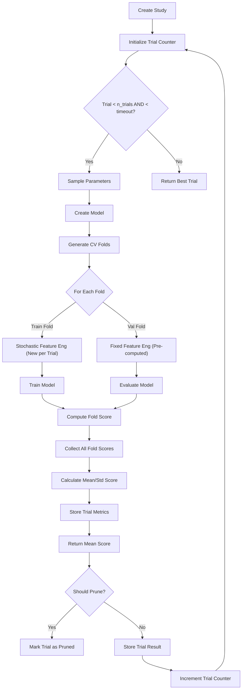

## 12. Competition Metric

The competition uses a weighted combination of F1-score and ROC-AUC to evaluate model performance, reflecting the importance of both precision/recall and ranking ability in the aquaculture detection task.

### Formula
```
Competition Score = 0.6 × F1-Score + 0.4 × ROC-AUC
```

### Component Metrics

#### F1-Score
- **Definition**: Harmonic mean of precision and recall
- **Formula**: F1 = 2 × (precision × recall) / (precision + recall)
- **Range**: [0, 1], where 1 represents perfect precision and recall
- **Focus**: Balance between false positives and false negatives
- **Sensitivity**: Particularly important when dealing with class imbalance

#### ROC-AUC
- **Definition**: Area under the Receiver Operating Characteristic curve
- **Measures**: Model's ability to distinguish between classes across all classification thresholds
- **Range**: [0.5, 1.0], where 0.5 is random guessing and 1.0 is perfect separation
- **Focus**: Ranking quality of predictions
- **Advantage**: Threshold-independent measure of model performance

### Weighting Rationale
- **60% F1-Score**: Emphasizes the importance of balanced precision and recall for practical detection tasks
- **40% ROC-AUC**: Rewards models that rank positive instances higher than negative ones, even if calibration needs improvement

### Calculation Process
1. **Probability Prediction**: Model outputs probabilities for positive class (aquaculture)
2. **Threshold Application**: Convert probabilities to binary predictions using 0.5 threshold
3. **Metric Calculation**: 
   - Compute F1-score using binary predictions and true labels
   - Compute ROC-AUC using probabilities and true labels
4. **Weighted Combination**: Apply the 0.6/0.4 weights to compute final score

### Implementation
The competition score is calculated in `metrics.py:competition_score()` function:

```python
def competition_score(y_true: np.ndarray, y_pred_proba: np.ndarray) -> float:
    """
    Calculate competition score: 0.6 * F1 + 0.4 * ROC-AUC
    
    Parameters
    ----------
    y_true : np.ndarray
        True binary labels (0 or 1)
    y_pred_proba : np.ndarray
        Predicted probabilities for positive class
        
    Returns
    -------
    float
        Competition score between 0 and 1
    """
    # Convert probabilities to binary predictions using 0.5 threshold
    y_pred = (y_pred_proba >= 0.5).astype(int)
    
    # Calculate F1-score
    f1 = f1_score(y_true, y_pred)
    
    # Calculate ROC-AUC
    roc_auc = roc_auc_score(y_true, y_pred_proba)
    
    # Return weighted combination
    return 0.6 * f1 + 0.4 * roc_auc
```

### Optimization Target
- **Objective**: Maximize competition score during Optuna hyperparameter optimization
- **Cross-Validation**: Score computed as mean across validation folds
- **Evaluation**: Final score reported on held-out test set

### Interpretation Guidelines
- **Score > 0.8**: Excellent performance
- **Score 0.7-0.8**: Strong performance
- **Score 0.6-0.7**: Moderate performance
- **Score < 0.6**: Weak performance requiring improvement

## 13. Final Model Training

### Post-Optimization Process

After Optuna completes:
1. **Best parameters extracted**: `study.best_params`
2. **Final model instantiated**: Using `ModelFactory.create()` with best params
3. **Training data**: Complete training dataset (everything except held-out test set)
4. **Feature engineering**: Applied with `training=True` (fresh stochastic realizations)
5. **Model fitting**: `.fit()` on full training dataset
6. **No cross-validation**: Single model trained on all available training data
7. **Evaluation**: On held-out test set only

### Implementation

Located in: `trainer.py:fit()` lines 536-550

```python
# Train final model with best parameters on FULL training data
# (everything except held-out test set)
self.model = ModelFactory.create(
    model_type=self.config.model_type,
    y_train=y_train_val,  # Full training data for class weighting
    **self.best_params
)

# Prepare features for FULL training data with training=True (fresh realizations)
X_features_train_full, _ = self._prepare_data(X_train_val_raw, y_train_val, training=True)

# Fit on complete training dataset (NO validation set, so early stopping disabled)
self.model.fit(X_features_train_full, y_train_val)
```

### Key Differences from Optimization Phase

| Aspect | Optuna Phase | Final Training |
|--------|--------------|----------------|
| **Training data** | Training folds (80% of train data) | Full training data (100% of train data) |
| **Feature randomness** | Training: New per trial<br>Validation: Fixed realizations | Fresh stochasticity (new realizations) |
| **Early stopping** | None (trains to full n_estimators) | None (trains to full n_estimators) |
| **Purpose** | Hyperparameter selection | Production model creation |
| **Evaluation** | CV score (mean of folds) | Hold-out test set only |

### Randomness in Final Training

- **Feature engineering**: Uses fresh randomness different from Optuna phase
- **Seed source**: `TrainingConfig.random_seed` (base seed)
- **Guarantees**: Different observation patterns than any Optuna trial
- **Implementation**: `trainer.py:fit()` line 540 (feature prep for full data)

### Deterministic Components

- **Best parameters**: Fixed from Optuna study
- **Model architecture**: Determined by best hyperparameters
- **Feature types**: Determined by configuration flags
- **Only variation**: Observation process (window selection, masking)

## 14. Saved Artifacts

### Artifact Inventory

| File | Purpose | Created When | Location |
|------|---------|--------------|----------|
| `best_model.pkl` | Trained model object | After final training | `experiment_dir/models/` |
| `optuna_study.pkl` | Complete Optuna study object | After optimization | `experiment_dir/models/` |
| `trainer.pkl` | Complete trainer object | After training completion | `experiment_dir/` |
| `config.yaml` | Training configuration | At start of training | `experiment_dir/` |
| `best_params.json` | Optimal hyperparameters | After optimization | `experiment_dir/` |
| `feature_names.json` | Engineered feature names | After feature engineering | `experiment_dir/features/` |
| `feature_importance.csv` | Feature importance scores | After final training (if available) | `experiment_dir/features/` |
| `metrics.json` | Training & test metrics | After final training evaluation | `experiment_dir/` |

### Detailed Artifact Descriptions

#### 14.1 best_model.pkl
- **Content**: Serialized `LGBMClassifier`, `CatBoostClassifier`, or `XGBClassifier` object
- **Creation**: `trainer.py:fit()` lines 386-390
- **Usage**: Model inference and further analysis
- **Size**: Typically 1-100 MB depending on model complexity

#### 14.2 optuna_study.pkl
- **Content**: Complete `optuna.Study` object containing all trial information
- **Creation**: `trainer.py:fit()` lines 350-353 via `optuna_utils:save_study()`
- **Usage**: Post-hoc analysis of optimization process
- **Contains**: 
  - All tried hyperparameters
  - Corresponding CV scores
  - Per-fold scores
  - Pruning decisions
  - Timestamps and user attributes

#### 14.3 trainer.pkl
- **Content**: Complete `Trainer` object state
- **Creation**: `io.py:save_artifacts()` lines 393-396
- **Usage**: Resuming analysis, inspecting intermediate states
- **Contains**: 
  - Feature engineer (fitted state)
  - Best model reference
  - Best parameters
  - Feature names
  - Study reference
  - Configuration

#### 14.4 config.yaml
- **Content**: Serialized `TrainingConfig` object
- **Creation**: `trainer.py:_save_config()` lines 115-119
- **Usage**: Reproducibility and experiment tracking
- **Format**: YAML for human readability

#### 14.5 best_params.json
- **Content**: Dictionary of optimal hyperparameters
- **Creation**: `trainer.py:fit()` lines 398-402
- **Usage**: Reproducing final model, understanding optimal settings
- **Format**: JSON for easy parsing

#### 14.6 feature_names.json
- **Content**: List of engineered feature names in order
- **Creation**: `trainer.py:fit()` lines 392-396 via `io:save_feature_names()`
- **Usage**: Ensuring feature consistency between training and inference
- **Example**: `["NDVI_01", "NDVI_02", ..., "optical_obs_12"]`

#### 14.7 feature_importance.csv
- **Content**: Feature importance scores with feature names
- **Creation**: `io.py:save_artifacts()` lines 417-424 (if model has feature_importances_)
- **Usage**: Model interpretation and feature selection
- **Format**: CSV with columns ['feature', 'importance']
- **Note**: Only saved for models supporting feature_importances_ (tree-based)

#### 14.8 metrics.json
- **Content**: Dictionary of training and test metrics
- **Creation**: `trainer.py:fit()` lines 371-374 via `io:save_metrics()`
- **Usage**: Performance tracking and comparison
- **Contains**:
  - training_competition_score
  - test_competition_score
  - cv_mean_score
  - cv_std_score
  - f1, roc_auc, precision, recall, accuracy (for both train and test)
  - per-fold CV scores

### Artifact Creation Timing

```mermaid
gantt
    title Artifact Creation Timeline
    dateFormat  HH:mm:ss
    section Training
    Config Save           :active, cs1, 00:00:00, 5s
    Hold Out Test Set     :active, hot, 00:00:05, 5s
    Generate CV Folds     :active, gc, 00:00:10, 5s
    Pre-compute Validation:active, pv, 00:00:15, 10s
    Optuna Optimization   :active, opt, 00:00:25, 20m
    Best Params Save      :active, bp, 00:20:25, 5s
    Study Pickle          :active, sp, 00:20:30, 5s
    Final Training        :active, ft, 00:20:35, 2m
    Model Pickle          :active, mp, 00:22:35, 5s
    Feature Names Save    :active, fn, 00:22:40, 5s
    Metrics Save          :active, me, 00:22:45, 5s
    Trainer Pickle        :active, tp, 00:22:50, 5s
```

## 15. Inference Pipeline

The inference pipeline generates predictions on new data using the trained model and feature engineering components. It ensures consistent processing between training and inference while maintaining computational efficiency.

### 15.1 Workflow Overview

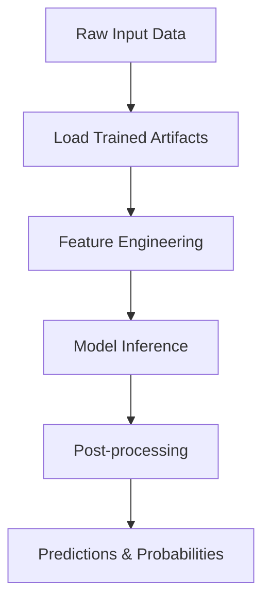

### 15.2 Component Details

#### 15.2.1 Artifact Loading
- **Model**: Loads `best_model.pkl` from experiment directory
- **Feature Engineer**: Uses the same `AquacultureConfig` from training to ensure feature consistency
- **Feature Names**: Loads `feature_names.json` to verify feature order matches training
- **Implementation**: `inference.py:InferencePipeline.__init__()` lines 45-75

#### 15.2.2 Feature Engineering Consistency
- **Deterministic Processing**: Uses `training=False` to ensure consistent, reproducible feature generation
- **Same Configuration**: Applies identical window selection and masking parameters as used during final training
- **No Stochasticity**: Unlike training, inference uses fixed parameters for reproducible results
- **Validation**: Checks that generated features match expected names and count from training

#### 15.2.3 Model Inference
- **Probability Prediction**: Uses `model.predict_proba()` to get class probabilities for the positive class
- **Binary Prediction**: Uses `predict()` method to convert probabilities to binary predictions using 0.5 threshold
- **Output Format**: `predict_proba()` returns probabilities only; `predict()` returns binary predictions only
- **Batch Processing**: Supports efficient batch inference on large datasets

#### 15.2.4 Post-processing
- **Submission Format**: Creates `submission.csv` with columns: `id`, `prediction`, `probability`
- **ID Mapping**: Preserves original sample IDs from input data for proper submission formatting
- **Value Clipping**: Ensures probabilities are in valid [0,1] range
- **Data Types**: Uses appropriate numeric types for storage efficiency

### 15.3 Implementation Details

```python
# InferencePipeline.predict_proba() method
def predict_proba(self, X: np.ndarray) -> np.ndarray:
    # 1. Feature engineering with training=False (deterministic)
    X_features, _ = self.feature_engineer.transform(X, training=False)
    X_features = X_features.values
    
    # 2. Model inference
    probabilities = self.model.predict_proba(X_features)
    
    # For binary classification, return probability of positive class
    if probabilities.shape[1] == 2:
        return probabilities[:, 1]
    else:
        return probabilities
```

Located in: `inference.py:InferencePipeline.predict_proba()` lines 90-121

### 15.4 Key Differences from Training

| Aspect | Training (`training=True`) | Inference (`training=False`) |
|--------|----------------------------|------------------------------|
| **Observation process** | Stochastic window selection + masking | Deterministic (uses fixed parameters) |
| **Randomness source** | `random_state` + trial/variation offsets | Fixed `random_state` (no variation) |
| **Masking application** | Full competition mask simulation | No masking - uses all available data |
| **Purpose** | Model generalization simulation | Production prediction |

### 15.5 Implementation Details

#### Feature Engineering in Inference
- **Masking simulation**: Disabled (`simulate_mask=False` implicitly)
- **Reason**: Inference should use all available data, not simulated partial observations
- **Implementation**: `inference.py:InferencePipeline.predict_proba()` lines 107-109
- **Actual call**: `self.feature_engineer.transform(X, training=False)`

#### Prediction Generation
- **Probability output**: `model.predict_proba()`[:, 1] for binary classification
- **Binary output**: `(probability >= 0.5).astype(int)` 
- **Implementation**: `inference.py:InferencePipeline.predict()` lines 71-72 and `predict_proba()` lines 115-121

#### Batch Processing
For large datasets, supports batching to manage memory:
- **Method**: `predict_proba_batch()` and `predict_batch()`
- **Batch size**: Configurable (default: 1000 samples)
- **Process**: 
  1. Split input into batches
  2. Process each batch through feature engineering + model
  3. Concatenate results
- **Implementation**: `inference.py:InferencePipeline.predict_proba_batch()` lines 150-175

#### Submission Creation
Creates `submission.csv` with required format:
```
id,prediction,probability
0,1,0.8734
1,0,0.2316
2,1,0.9127
...
```

Where:
- **id**: Sample identifier from test dataset
- **prediction**: Binary class (0 or 1)  
- **probability**: Float probability of positive class

Implemented in: `inference.py:InferencePipeline.create_submission()` lines 186-210

## 16. Training vs Validation vs Test

### Comparison Matrix

| Aspect | Training (CV) | Validation (CV) | Test Set |
|--------|---------------|-----------------|----------|
| **Data source** | Training folds (80% of train data) | Validation folds (20% of train data) | Held-out test set (20% of total) |
| **Masking simulation** | ✅ Enabled (stochastic - NEW per trial) | ✅ Enabled (fixed realizations) | ✅ Enabled (deterministic) |
| **Feature randomness** | High (new per epoch/trial) | Medium (fixed realizations) | Low (deterministic simulation) |
| **Labels used** | ✅ Yes (for loss calculation) | ✅ Yes (for metric calculation) | ❌ No (predictions only) |
| **Model updates** | ✅ Yes (backpropagation) | ❌ No (evaluation only) | ❌ No (inference only) |
| **Purpose** | Model fitting | Hyperparameter evaluation | Final prediction |
| **Stochastic elements** | Window selection, monthly dropout, data ordering (NEW per trial) | Fixed window/mask per realization (SAME across trials) | None (uses fixed seed) |
| **Early stopping** | ❌ Not used | N/A | N/A |
| **CV Reporting** | N/A | Mean score across folds & realizations | N/A |

### Detailed Process Flow

#### Training Phase (During Optuna)
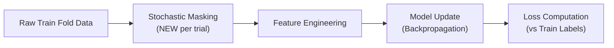

#### Validation Phase (During Optuna)
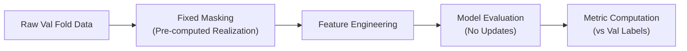

#### Final Training Phase
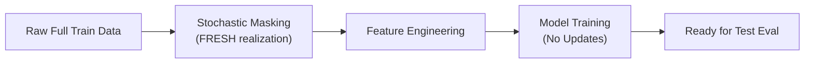

#### Test Phase
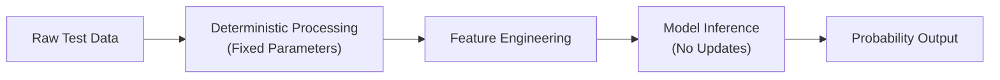

### Key Design Justifications

1. **Stochastic training masks (NEW per trial)**: 
   - Improves model robustness to missing data
   - Prevents overfitting to specific observation patterns
   - Simulates real-world data variability
   - Each trial sees different training observations

2. **Fixed validation realizations**:
   - Ensures fair hyperparameter comparison
   - Reduces optimization noise
   - Enables meaningful gradient signals in parameter space
   - Same validation data for ALL trials

3. **Deterministic test processing**:
   - Applies observation process simulation with fixed parameters
   - Evaluates model under same conditions as training
   - Matches expected competition
4. Hold-out Purity:** Entirely untouched until final evaluation
   - Provides unbiased estimate of generalization performance
   - No data leakage from training or optimization process

## 17. Reproducibility

### Random Seed Management

All randomness is controlled through `TrainingConfig.random_seed`:

| Component | Seed Source | Purpose |
|-----------|-------------|---------|
| **NumPy** | `np.random.seed(base_seed)` | Array operations, shuffling |
| **Python random** | `random.seed(base_seed)` | Legacy random operations |
| **Environment** | `PYTHONHASHSEED=str(base_seed)` | Hash randomization |
| **Optuna sampler** | `TPESampler(seed=base_seed)` | Parameter sampling |
| **Feature engineering** | `base_seed + offset` | Observation process variation |
| **Train/val split** | `random_state=base_seed` | Stratified splitting |

### Deterministic Components

These components produce identical results given same seed and data:
1. **Data loading and splitting** (train/val split)
2. **Optuna study creation** (sampler initialization)
3. **Feature engineer initialization** (when `random_state` provided)
4. **Model creation** (when hyperparameters fixed)
5. **Metric calculations** (scikit-learn functions)

### Stochastic Components

These intentionally vary even with fixed seed:
1. **Observation process** during training:
   - Window selection (4-6 months)
   - Start month selection  
   - Monthly S2 band dropout
2. **Data ordering** in stochastic optimizers (if any)
3. **Dropout** in neural network layers (not used in current GBM models)

### Reproducibility Guarantees

Given fixed `TrainingConfig.random_seed` and identical input data:
- **Same train/validation split** every run
- **Same Optuna study structure** (sampler initialization)
- **Same feature engineer sequence** (if tracking state)
- **Same final model** (if using deterministic feature engineering)

Note: True bit-for-bit reproducibility may vary slightly due to:
- Floating point non-associativity in parallel operations
- Thread scheduling differences in BLAS libraries
- OS-level timing variations

However, results will be statistically equivalent and functionally identical.

### Verification Methods

Reproducibility can be verified by:
1. **Training twice** with same seed → identical validation scores
2. **Checking feature engineer state** after same number of calls
3. **Verifying selected hyperparameters** identical across runs
4. **Confirming prediction arrays** match within floating point tolerance

### Comprehensive Seed Management

The pipeline implements a sophisticated seeding strategy to ensure reproducibility while allowing for stochastic variations where beneficial:

#### 17.1 Master Seed Control
- **Single source of truth**: `TrainingConfig.random_seed` controls all random processes
- **Deterministic output**: Same seed produces identical results across runs
- **Implementation**: `trainer.py:_set_random_seeds()` lines 73-81

#### 17.2 Seed Diversification Strategy
Different components receive derived seeds to prevent correlation:

| Component | Seed Formula | Purpose |
|-----------|--------------|---------|
| **Feature Engineering (Train Folds)** | `base_seed + trial_num × 1000 + fold_id × 100` | Unique realization per trial per fold |
| **Validation Realizations** | `base_seed + fold_id × 10000 + realization_id × 1000` | Fixed realizations per fold (across trials) |
| **Final Training** | `base_seed` | Fresh realizations different from Optuna |
| **Test Set Processing** | `base_seed` | Deterministic processing (same as final training seed) |
| **Optuna Sampler** | `base_seed` | Reproducible parameter sampling |
| **CV Split Generation** | `base_seed` | Reproducible fold assignments |

#### 17.3 Reproducibility Guarantees
- **Identical seeds** → **identical** feature engineering, model training, and evaluation results
- **Deterministic test set processing**: Ensures consistent final evaluation
- **Fixed validation realizations**: Enables fair hyperparameter comparison across trials
- **Stochastic training features**: Improves model robustness while maintaining reproducibility

#### 17.4 Verification Process
To verify reproducibility:
1. Set fixed `TrainingConfig.random_seed`
2. Run complete pipeline multiple times
3. Compare:
   - Final model weights/biases
   - Test set predictions
   - Optimization history (trial parameters and values)
   - Generated feature matrices (for identical input data)

#### 17.5 Limitations
- **Hardware-dependent variations**: Minor numerical differences possible across different CPU architectures or GPU vs CPU
- **Library version sensitivity**: Exact reproducibility requires pinned library versions (see requirements.txt)
- **Threading nondeterminism**: Some libraries may have minor thread scheduling variations (controlled via environment variables where possible)

### Implementation Locations
- Seed initialization: `trainer.py:_set_random_seeds()` lines 73-81
- Feature engineer seeding: `optuna_utils.py:create_objective_function()` lines 185-205
- Validation realization seeding: `trainer.py:_generate_validation_realizations_for_fold()` lines 355-357
- Optuna sampler: `optuna_utils.py:create_optuna_study()` lines 30-34
- CV splitter: `optuna_utils.py:create_objective_function()` lines 165-171

## 18. Configuration

### Configuration Hierarchy

```
TrainingConfig (src/config.py)
├── Model Selection
│   └── model_type: str ('lightgbm'|'catboost'|'xgboost')
├── Reproducibility  
│   └── random_seed: int
├── Hold-Out Test Set
│   └── test_size: float (default: 0.2) - proportion held out for final evaluation
├── Cross Validation
│   ├── n_splits: int (default: 5)
│   └── StratifiedKFold configuration
├── Optimization
│   ├── n_trials: int (default: 100)
│   └── timeout: int (default: 3600 seconds)
├── Validation Realizations
│   └── n_validation_realizations: int (default: 1) - realizations per CV fold
├── Early Stopping
│   └── early_stopping_rounds: int (default: 50) - unused in Optuna phase
├── Learning
│   └── learning_rate: float (default: 0.1 - overridden by Optuna)
└── Feature Engineering
    └── feature_engineering_config: AquacultureConfig
```

### Key Configuration Changes for CV

1. **Removed**: `validation_size` parameter (no longer needed)
2. **Kept**: `test_size` for hold-out test set (default 0.2)
3. **Kept**: `n_splits` for CV folds (default 5)
4. **Added**: Clarification that `n_validation_realizations` applies to CV folds
5. **Updated**: Documentation to reflect CV-based workflow

### AquacultureConfig Details

While the structure of `AquacultureConfig` remains unchanged, its role has been emphasized throughout the updated pipeline documentation. This configuration object controls all aspects of the feature engineering process and is critical for reproducibility.

Key configuration groups that impact the pipeline:

1. **Observation Process Simulation**
   - `simulate_mask`: Enable/disable stochastic masking (True for training, False for inference)
   - `window_length_probs`: Probabilities for 4,5,6 month window selection
   - `start_month_distribution`: Optional custom distribution for start month selection
   - `s2_monthly_dropout`: 12-values array defining monthly S2 band dropout probabilities

2. **Feature Group Selection**
   - `include_optical`: Enable spectral indices and optical bands
   - `include_sar`: Enable SAR features (VH, VV, ratio, difference)
   - `include_cross_sensor_features`: Enable SAR-optical interactions
   - `include_temporal_statistics`: Enable temporal statistics (mean, std, min, max, amplitude, slope)
   - `include_metadata`: Enable metadata features (window length, observation flags, etc.)

3. **Reproducibility Controls**
   - `random_state`: Seed for all stochastic processes in feature engineering

The configuration is passed from `TrainingConfig.feature_engineering_config` to the `AquacultureFeatureEngineer` and is serialized alongside other experiment artifacts for complete reproducibility.

All feature engineering parameters are validated and logged to ensure experimental consistency.

## 19. Performance Considerations

### Computational Complexity

#### Feature Engineering
- **Basic operations** (band extraction, masking, NaN conversion): O(n_samples × n_time_steps × n_bands)
  Since n_time_steps=12 and n_bands=12 are constants, this simplifies to O(n_samples)
- **Spectral indices** (NDVI, NDWI, etc.): O(n_samples × n_time_steps) per index
  With 6 indices and constant n_time_steps=12: O(n_samples) per index
- **Temporal statistics** (mean, std, min, max, amplitude, slope):
  - For F_monthly base features: O(F_monthly × n_samples × n_time_steps)
  - F_monthly grows linearly with enabled feature groups
  - When all features enabled: F_monthly ≈ 276 (72+600 feature example)
  - Results in dominant O(n_samples) term with large constant factor
- **Memory usage**: O(n_samples × n_features) for feature storage
  - Typical range: 200-2000+ features depending on configuration
  - Example: 10,000 samples × 500 features × 8 bytes = ~40 MB

#### Model Training
- **Time complexity**: O(n_estimators × n_samples × log(n_samples) × n_features)
- **With CV**: Total complexity increases by factor of n_folds during optimization
- **Typical runtime**: 10-300 seconds per model (highly variable)
- **Optimization runtime**: O(n_trials × n_folds × training_complexity)

#### Hyperparameter Optimization
- **Total complexity**: O(n_trials × n_folds × training_complexity)
- **With pruning**: ~30-70% of theoretical maximum
- **Typical runtime**: 15-150 minutes for n_trials=100, n_folds=5

### Memory Usage
- **Peak memory**: Domined by feature matrix storage (n_samples × n_features × 8 bytes)
- **With CV**: Additional memory for storing fold-specific data structures
- **Optimization overhead**: Minimal - Optuna stores trial results efficiently
- **Typical usage**: 2-8 GB for moderate datasets (10K-100K samples, 100-500 features)

### Bottlenecks
1. **Feature engineering computation** (CPU-bound)
   - Spectral index calculations and temporal statistics
   - Can be optimized with vectorization and parallel processing
   
2. **Model training** (CPU-bound, multiplied by n_folds during optimization)
   - Gradient boosting algorithms are inherently sequential
   - Tree splitting operations dominate computation time
   
3. **I/O operations** (disk-bound)
   - Reading/writing large feature matrices
   - Model serialization/deserialization
   - Experiment tracking and artifact storage

### Optimization Strategies
1. **Feature engineering**:
   - Pre-compute reusable components (e.g., spectral indices)
   - Use NumPy vectorization instead of Python loops
   - Consider chunked processing for extremely large datasets
   
2. **Model training**:
   - Utilize native parallelism in boosting libraries (n_jobs parameter)
   - Consider histogram-based algorithms for faster splitting (LightGBM)
   - Early stopping during final training (when enabled)
   
3. **Hyperparameter optimization**:
   - Leverage pruning to eliminate unpromising trials early
   - Use warmer starts or transfer learning from related problems
   - Parallelize trials when resources permit (Optuna supports distributed optimization)

4. **System-level optimizations**:
   - Ensure adequate RAM to avoid swapping
   - Use SSD storage for faster I/O operations
   - Monitor CPU utilization and consider process affinity settings


## 20. Future Improvements

### 20.1 Short-Term Enhancements (0-3 months)

#### 20.1.1 Advanced Validation Strategies
- **Group K-Fold CV**: Implement grouped cross-validation to prevent data leakage when samples have inherent groupings (e.g., geographic proximity-based sampling from same geographic region)
- **Purged K-Fold CV**: Add purging techniques to reduce overfitting from temporal autocorrelation in time-series data
- **Combinatorial Purged Cross-Validation (CPCV)**: Implement advanced CV techniques specifically designed for financial/time-series data

#### 20.1.2 Hyperparameter Optimization Improvements
- **Multi-objective optimization**: Optimize for multiple metrics simultaneously (e.g., competition score + training time + model size)
- **Nested cross-validation**: Implement nested CV to get unbiased estimate of generalization performance
- **Warm-starting Optuna studies**: Enable resuming optimization studies from previous trials
- **Transfer learning for hyperparameters**: Use results from similar datasets/problems to inform prior distributions

#### 20.1.3 Feature Engineering Enhancements
- **Adaptive feature selection**: Automatically identify and remove low-importance or redundant features
- **Feature interaction detection**: Automatically detect and create valuable feature interactions
- **Temporal feature importance**: Analyze how feature importance changes over time/windows
- **Automatic feature engineering**: Integrate with libraries like FeatureTools for automated feature generation

### 20.2 Medium-Term Enhancements (3-12 months)

#### 20.2.1 Model Architecture Improvements
- **Deep learning alternatives**: Explore neural network architectures (CNNs, RNNs, Transformers) for spatiotemporal satellite data
- **Ensemble methods**: Implement sophisticated ensembling techniques (stacking, blending) beyond simple averaging
- **Uncertainty quantification**: Add prediction confidence intervals using techniques like Monte Carlo dropout or deep ensembles
- **Multi-task learning**: Expand to predict multiple related aquaculture characteristics simultaneously

#### 20.2.2 Pipeline Robustness & Monitoring
- **Data drift detection**: Implement automated monitoring for distribution shifts between training and production data
- **Model performance tracking**: Continuous monitoring of deployed model performance with automated alerts
- **Automated retraining triggers**: Systematically retrain models when performance degrades beyond thresholds
- **Experiment tracking integration**: Integrate with tools like MLflow, Weights & Biases, or TensorBoard for comprehensive experiment management

#### 20.2.3 Computational Efficiency
- **GPU acceleration**: Utilize GPU-enabled versions of algorithms (XGBoost, LightGBM) where beneficial
- **Parallel processing**: Implement joblib-based parallelization for feature engineering and model training
- **Incremental learning**: Explore online learning approaches for continuous model updates
- **Model compression**: Implement techniques like pruning, quantization, or knowledge distillation for deployment efficiency

### 20.3 Long-Term Vision (1+ years)

#### 20.3.1 Adaptive Learning Pipeline
- **Self-optimizing pipelines**: Automatically adjust feature engineering complexity based on data characteristics
- **Dynamic model selection**: Automatically choose optimal model architecture based on problem complexity and data size
- **Active learning integration**: intelligently select most informative samples for labeling to reduce annotation costs

#### 20.3.2 Explainability & Interpretability
- **Comprehensive feature interaction analysis**: Advanced SHAP and interaction value computations
- **Temporal attention mechanisms**: Visualize which time periods contribute most to predictions
- **Spatial explanation maps**: For geospatial data, show which regions drive predictions
- **Counterfactual explanations**: Generate "what-if" scenarios to understand model decisions

#### 20.3.3 Production & Deployment
- **RESTful API microservice**: Containerized inference service with auto-scaling capabilities
- **Real-time inference pipeline**: Stream processing capabilities for live satellite data feeds
- **Edge deployment options**: Optimized models for deployment on edge devices or satellite onboard processing
- **A/B testing framework**: Statistical framework for safely deploying model updates in production

#### 20.3.4 Scientific Rigor & Reproducibility
- **Benchmark suite**: Standardized benchmark datasets and evaluation protocols for aquaculture ML
- **Uncertainty quantification standards**: Community standards for reporting prediction uncertainty
- **Metadata enrichment**: Automated generation of comprehensive metadata for reproducibility
- **Cross-domain transfer learning**: Techniques to leverage knowledge from related geographical regions or farming practices

### 20.4 Implementation Prioritization Framework

Features should be evaluated based on:
1. **Impact on model performance** (expected improvement in competition score)
2. **Implementation complexity** (development time and risk)
3. **Computational overhead** (training/inference time and resource requirements)
4. **Maintenance burden** (ongoing support and documentation needs)
5. **Alignment with project goals** (reproducibility, interpretability, production readiness)

### 20.5 Open Research Questions

#### 20.5.1 Data-Specific Challenges
- Optimal window size for different aquaculture species and geographical regions
- Minimum viable observation density for reliable predictions
- Transfer learning effectiveness across different farming practices and environmental conditions

#### 20.5.2 Methodological Advances
- Best practices for uncertainty quantification in spatiotemporal environmental modeling
- Optimal balance between model complexity and interpretability for stakeholder trust
- Most effective ways to incorporate domain knowledge into machine learning pipelines

#### 20.5.3 Operational Considerations
- Cost-benefit analysis of model complexity vs. prediction value
- Optimal retraining frequency given concept drift in aquaculture environments
- Integration pathways with existing aquaculture management software and decision support systems

The modular architecture of this pipeline facilitates incremental adoption of these improvements, allowing teams to implement enhancements that provide the highest return on investment for their specific use cases.