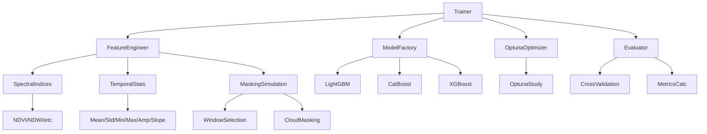
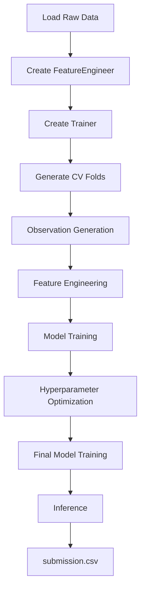
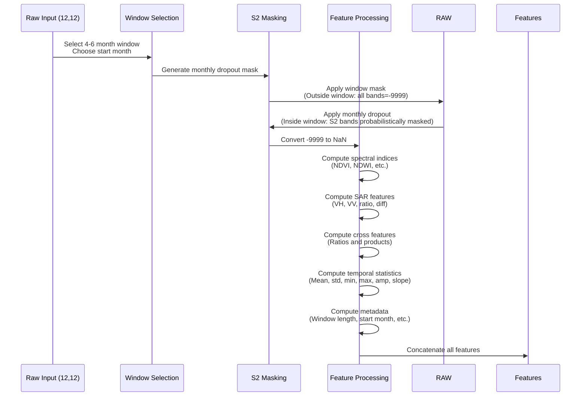
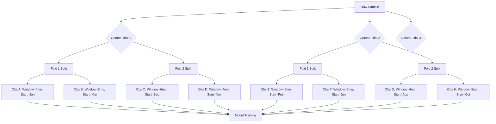
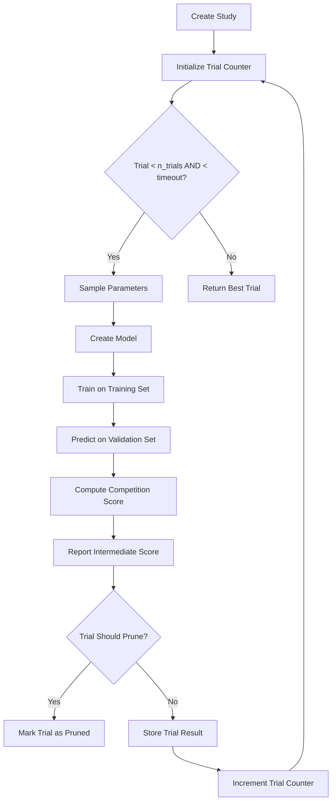
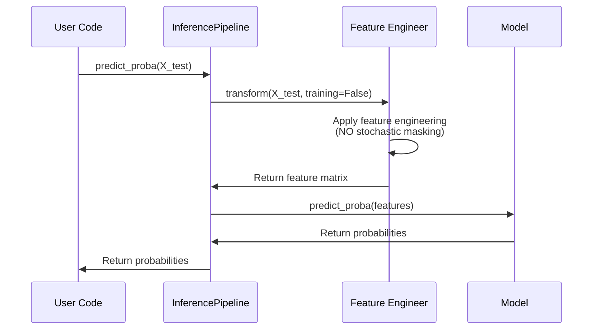
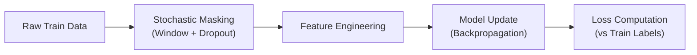
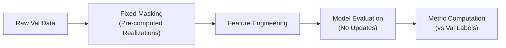
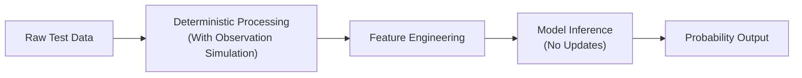

# Aquaculture Machine Learning Pipeline Architecture

## Table of Contents
1. [Project Overview](#1-project-overview)
2. [Complete Execution Flow](#2-complete-execution-flow)
3. [Training Data](#3-training-data)
4. [Cross Validation](#4-cross-validation)
5. [Observation Process](#5-observation-process)
6. [Training Observation Generation](#6-training-observation-generation)
7. [Validation Pipeline](#7-validation-pipeline)
8. [Feature Engineering](#8-feature-engineering)
9. [Feature Matrix](#9-feature-matrix)
10. [Model Training](#10-model-training)
11. [Hyperparameter Optimization](#11-hyperparameter-optimization)
12. [Competition Metric](#12-competition-metric)
13. [Final Model Training](#13-final-model-training)
14. [Saved Artifacts](#14-saved-artifacts)
15. [Inference Pipeline](#15-inference-pipeline)
16. [Training vs Validation vs Test](#16-training-vs-validation-vs-test)
17. [Reproducibility](#17-reproducibility)
18. [Configuration](#18-configuration)
19. [Performance Considerations](#19-performance-considerations)
20. [Future Improvements](#20-future-improvements)

## 1. Project Overview

### Repository Organization

The aquaculture machine learning framework follows a modular structure:

```
geoai_aquaculture/
├── aquaculture/                 # Core feature engineering module
│   ├── __init__.py
│   ├── config.py               # AquacultureConfig dataclass
│   ├── feature_engineering.py  # Main feature engineering transformer
│   ├── indices.py              # Spectral index calculations
│   ├── masking.py              # Cloud masking and contamination simulation
│   └── temporal.py             # Temporal statistics computation
├── src/                         # Training and inference framework
│   ├── __init__.py
│   ├── config.py               # TrainingConfig dataclass
│   ├── trainer.py              # Main Trainer class orchestrating pipeline
│   ├── model_factory.py        # Model creation with class weighting
│   ├── optuna_utils.py         # Hyperparameter optimization utilities
│   ├── evaluate.py             # Model evaluation and cross-validation
│   ├── metrics.py              # Competition score and metrics calculation
│   ├── inference.py            # Inference pipeline for predictions
│   └── io.py                   # Input/output utilities
├── data/                        # Data storage (not tracked in git)
├── experiments/                 # Experiment outputs
├── models/                      # Saved models
├── notebooks/                   # Jupyter notebooks
├── spatial_blocks/              # Spatial blocking utilities
├── tests/                       # Unit tests
├── requirements.txt             # Python dependencies
└── README.md                    # Project overview
```

### Module Responsibilities

| Module | Responsibility |
|--------|----------------|
| `aquaculture.feature_engineering` | Feature extraction from raw satellite timesteps |
| `aquaculture.indices` | Spectral index calculations (NDVI, NDWI, etc.) |
| `aquaculture.masking` | Cloud masking simulation and window selection |
| `aquaculture.temporal` | Temporal statistics computation (mean, std, trend) |
| `src.config` | Training configuration management |
| `src.trainer` | Main orchestrates the complete pipeline | Model factory for LightGBM, CatBoost, XGBoost with class weighting |
| `src.optuna_utils` | Hyperparameter optimization using Optuna |
| `src.evaluate` | Cross-validation and model evaluation |
| `src.metrics` | Competition score (0.6*F1 + 0.4*ROC-AUC) calculation |
| `src.inference` | Prediction pipeline for test data |
| `src.io` | Model, configuration, and artifact persistence |

### Dependency Diagram



## 2. Complete Execution Flow

### High-Level Flowchart



### Stage-by-Stage Description

#### 2.1 Load Raw Data
- Raw data consists of multi-temporal Sentinel-1 SAR and Sentinel-2 multispectral imagery
- Shape: `(n_samples, 12 time steps, 12 bands)` or flattened `(n_samples, 144)`
- Band order: [0:VH, 1:VV, 2:blue, 3:green, 4:red, 5:re1, 6:re2, 7:re3, 8:nir, 9:nnir, 10:swir1, 11:swir2]
- Implemented in: `trainer.py:_prepare_data()` lines 121-193

#### 2.2 Create FeatureEngineer
- Instantiates `AquacultureFeatureEngineer` with configuration from `TrainingConfig`
- Configuration includes masking simulation, feature inclusion flags, and random state
- Implemented in: `trainer.py:_prepare_data()` lines 166-179

#### 2.3 Create Trainer
- Main orchestrator that coordinates all pipeline components
- Initializes random seeds for reproducibility
- Creates experiment directory for artifact storage
- Implemented in: `trainer.py:__init__()` lines 47-71

#### 2.4 Generate CV Folds
- Uses `StratifiedKFold` from scikit-learn with shuffling
- Number of splits defined by `TrainingConfig.n_splits` (default: 5)
- Random state controlled by `TrainingConfig.random_seed`
- Implemented in: `evaluate.py:cross_validate_model()` lines 19-99

#### 2.5 Observation Generation
- Simulates partial observations through window selection and cloud masking
- **Training**: Stochastic window selection (4-6 months) + monthly S2 band dropout
- **Validation/Test**: Fixed window selection (no stochasticity during Optuna)
- Implemented in: `masking.py:apply_competition_mask()` lines 191-248

#### 2.6 Feature Engineering
- Transforms raw satellite data into engineered features
- Computes spectral indices, SAR features, cross-sensor features
- Calculates temporal statistics and metadata features
- Implemented in: `feature_engineering.py:transform()` lines 250-557

#### 2.7 Model Training
- Trains base models (LightGBM/CatBoost/XGBoost) on engineered features
- Uses class weighting to handle imbalance via `scale_pos_weight`
- Early stopping based on validation performance
- Implemented in: `model_factory.py:create()` lines 55-126

#### 2.8 Hyperparameter Optimization
- Uses Optuna to optimize hyperparameters
- Maximizes competition score (0.6*F1 + 0.4*ROC-AUC)
- Supports pruning of unpromising trials
- Implemented in: `optuna_utils.py:optimize_hyperparameters()` lines 190-261

#### 2.9 Final Model Training
- Trains final model on complete dataset using best hyperparameters
- Uses same feature engineering pipeline (with stochastic masking for training)
- Implemented in: `trainer.py:fit()` lines 355-364

#### 2.10 Inference
- Loads trained model and feature engineering pipeline
- Transforms test data using fixed parameters (no stochasticity)
- Generates probability predictions and binary classifications
- Creates submission.csv in required format
- Implemented in: `inference.py:InferencePipeline.predict_proba()` lines 90-121

#### 2.11 submission.csv
- Contains three columns: `id`, `prediction`, `probability`
- `id`: Sample identifier from test dataset
- `prediction`: Binary class (0 or 1) using threshold 0.5
- `probability`: Probability of positive class (aquaculture)
- Implemented in: `inference.py:InferencePipeline.create_submission()` lines 177-210

## 3. Training Data

### Data Loading Location
- Data loading occurs in user code before calling `Trainer.fit()`
- Trainer expects pre-loaded NumPy arrays
- Implemented in: `trainer.py:fit()` lines 301-307 (train/val split)

### Expected Input Format
Two accepted formats:
1. 3D array: `(n_samples, 12 time steps, 12 bands)` 
2. 2D array: `(n_samples, 144)` representing flattened 3D data

Band ordering (consistent in both formats):
```
0: VH (VH polarization)
1: VV (VV polarization)
2: Blue (Sentinel-2 B02)
3: Green (Sentinel-2 B03)
4: NIR (Sentinel-2 B08)
5: NIRA (Sentinel-2 B8A)
6: RE1 (Sentinel-2 B05)
7: RE2 (Sentinel-2 B06)
8: RE3 (Sentinel-2 B07)
9: Red (Sentinel-2 B04)
10: SWIR1 (Sentinel-2 B11)
11: SWIR2 (Sentinel-2 B12)
```

Implemented in: `trainer.py:_prepare_data()` lines 142-157

### Tensor Dimensions
- **Input**: `(n_samples, 12, 12)` or `(n_samples, 144)`
- **After feature engineering**: `(n_samples, n_engineered_features)`
- **Feature count**: Variable based on configuration (typically 100-300+ features)

### Feature Ordering
Features are generated in deterministic order:
1. Optical indices (NDVI, NDWI, MNDWI, NDMI, NDRE2, NDRE3) × 12 months
2. Optical bands (green, nir, nira, swir1, swir2) × 12 months  
3. SAR features (VH, VV, VH_VV_ratio, VH_VV_diff) × 12 months
4. Cross-sensor features (if enabled) × 12 months
5. Temporal statistics (mean, std, min, max, amplitude, slope) × all features
6. Metadata features (window_length, start_month, end_month, n_optical_obs, fraction_optical, monthly_obs_flags)

Implemented in: `feature_engineering.py:_build_feature_names()` lines 200-248

### Labels
- Binary classification: 0 (non-aquaculture), 1 (aquaculture)
- Shape: `(n_samples,)`
- Expected to be balanced or slightly imbalanced
- Handled via class weighting in model factory

### Missing Value Representation
- Missing/cloud-masked values represented as `-9999.0`
- Converted to `np.nan` for internal processing
- Temporal statistics handle NaN differently for SAR vs optical features:
  - SAR: NaN propagates (results in NaN statistic if any NaN present)
  - Optical: NaN values ignored in calculations
- Implemented in: `feature_engineering.py:transform()` lines 323-324 and `temporal.py` functions

## 4. Cross Validation

### Strategy
- Uses `StratifiedKFold` with shuffling to maintain class distribution
- Number of folds: `TrainingConfig.n_splits` (default: 5)
- Random state: `TrainingConfig.random_seed` for reproducibility

### Implementation Details
```python
skf = StratifiedKFold(n_splits=n_splits, shuffle=True, random_state=random_state)
for fold_idx, (train_idx, val_idx) in skf.split(X, y):
    # Process fold
```

Located in: `evaluate.py:cross_validate_model()` lines 52-65

### Fold Generation Process
For each fold:
1. Training indices: ~80% of data (stratified)
2. Validation indices: ~20% of data (stratified)
3. Indices are shuffled before splitting to prevent ordering bias

### Example Fold Split (Conceptual)
With 100 samples and 5 folds:
- **Fold 1**: Train=[0-15,20-35,40-55,60-75,80-95], Val=[16-19,36-39,56-59,76-79,96-99]
- **Fold 2**: Train=[0-4,16-19,36-39,56-59,76-79,96-99], Val=[5-15,20-35,40-55,60-75,80-95]
- ...and so on for all 5 folds

### Reproducibility
- Controlled by `TrainingConfig.random_seed`
- Ensures identical fold splits across runs
- Verified by setting seed before `StratifiedKFold` initialization

## 5. Observation Process

### Purpose
The observation process simulates real-world satellite data limitations:
- Cloud contamination affecting Sentinel-2 optical bands
- Temporal gaps due to satellite revisit patterns
- SAR data unaffected by clouds (always available)

This differs from traditional data augmentation as it:
1. Mimics actual data collection constraints
2. Creates realistic missing data patterns
3. Preserves temporal correlations within observation windows
4. Applies different masking strategies to SAR vs optical bands

### Implementation Process

For each sample during training (`training=True` in `feature_engineer.transform()`):

#### 5.1 Window Selection
- Choose window length: 4, 5, or 6 months
- Probabilities: `window_length_probs` (default: [1/3, 1/3, 1/3])
- Choose start month: 0-11 (Jan-Dec)
- If `start_month_distribution` provided, use categorical distribution
- Otherwise, uniform distribution over valid start months (0 to 12-window_length)

Implemented in:
- `masking.py:select_window_length()` lines 53-78
- `masking.py:select_start_month()` lines 81-123

#### 5.2 Sentinel-2 Masking
- For months OUTSIDE selected window: ALL bands set to -9999 (missing)
- For months INSIDE window: 
  - SAR bands (VH, VV indices 0,1): Always preserved
  - S2 bands (indices 2-11): Subject to monthly dropout
- Monthly dropout probabilities: `s2_monthly_dropout` (12 values, 0-1)
- For each S2 band in each window month: 
  - Sample uniform random [0,1)
  - If < dropout probability: set to -9999 (masked)
  - Else: preserve original value

Implemented in:
- `feature_engineering.py:transform()` lines 276-322 (main loop)
- `masking.py:create_s2_mask()` lines 126-189
- `masking.py:apply_s2_masking()` lines 192-235

#### 5.3 Sentinel-1 Handling
- SAR bands (indices 0,1) are NEVER masked
- Always retain original values regardless of window or dropout
- Reflects SAR's all-weather capability

#### Sequence Diagram: Single Sample Transformation



## 6. Training Observation Generation

### Observation Generation Mechanics

During training, each raw sample can generate multiple observations through stochastic processes:

#### 6.1 Observation Sources
1. **Original record**: Single deterministic view (when `training=False`)
2. **Optuna trials**: Each trial may see different observations
3. **Cross-validation folds**: Each fold uses different data splits
4. **Validation realizations**: Multiple stochastic views for validation averaging

#### 6.2 Observation Generation Flow



### Observation Regeneration Timing

Observations are regenerated at these specific points:

#### 6.2.1 During Optuna Optimization
- **New observation per trial**: Each hyperparameter trial gets freshly generated observations
- **Randomness source**: `TrainingConfig.random_seed + trial_number * offset`
- **Implementation**: `optuna_utils.py:create_objective_function()` lines 156-171
- **Regeneration frequency**: Every Optuna trial

#### 6.2.2 During Cross-Validation
- **Fixed observations per fold**: Validation realizations are fixed within Optuna study
- **Purpose**: Ensures fair comparison between hyperparameter configurations
- **Implementation**: `trainer.py:_generate_validation_realizations()` lines 194-268
- **Regeneration frequency**: Once per Optuna study (reused across trials)

#### 6.2.3 During Final Training
- **New observation**: Uses fresh randomness different from Optuna phase
- **Randomness source**: `TrainingConfig.random_seed` (final training seed)
- **Implementation**: `trainer.py:fit()` lines 310, 316, 364
- **Regeneration frequency**: Once for final model training

### Unique Observation Count Calculation

For a single training record, maximum unique observations:

```
N_observations = 
    (n_trials × n_folds × n_validation_realizations) + 
    (n_final_training) +
    1  [original deterministic observation]
```

With default settings:
- `n_trials` = 100
- `n_folds` = 5 (from cross-validation)
- `n_validation_realizations` = 1 or 5
- `n_final_training` = 1

**Minimum** (n_validation_realizations=1): 
(100 × 5 × 1) + 1 + 1 = 502 observations

**Maximum** (n_validation_realizations=5): 
(100 × 5 × 5) + 1 + 1 = 2502 observations

### Random Seed Management

- **Optuna trials**: `base_seed + trial_id * 1000` 
- **Validation realizations**: `base_seed + realization_id * 1000`
- **Final training**: `base_seed`
- Ensures no overlap in random sequences
- Implemented in: `trainer.py:_set_random_seeds()` lines 73-81 and usage throughout

## 7. Validation Pipeline

### Validation Observation Creation

Validation observations are created through a specialized process designed for fair hyperparameter comparison:

#### 7.1 Process Overview
1. Split data into train/validation sets (80/20 stratified)
2. Generate fixed validation realizations from **raw validation data**
3. Use first realization for Optuna optimization
4. Average score across all realizations for final evaluation (if n_validation_realizations > 1)

#### 7.2 Implementation Details

```python
# In trainer.py:_generate_validation_realizations()
for i in range(n_validation_realizations):
    # Create temporary feature engineer with specific seed
    temp_fe = AquacultureFeatureEngineer(
        simulate_mask=True,  # Always simulate for validation
        random_state=base_seed + i * 1000,
        # ... other config parameters
    )
    # Process validation data through this engineer
    X_realized = temp_fe.transform(X_val_raw, training=True)
    realizations.append((X_realized.values, y_val))
```

Located in: `trainer.py:_generate_validation_realizations()` lines 194-268

### Fixed vs Regenerated Validation

#### Why Fixed During Optuna?
- Ensures fair comparison: All hyperparameter trials evaluated on same data
- Prevents noise in optimization from validation set variability
- Maintains statistical validity of optimization process

#### Why Regenerated for Final Evaluation?
- Better estimate of true generalization performance
- Accounts for variance in observation process
- More robust performance estimate

#### Implementation Difference
- **Optuna phase**: Uses first validation realization only (`val_realizations[0]`)
- **Final evaluation**: Averages across all `n_validation_realizations`

Located in: `trainer.py:fit()` lines 331-332 (Optuna) and lines 367-374 (final eval)

### Design Rationale

This design was chosen to:
1. **Reduce optimization noise**: Fixed validation set prevents misleading gradient signals
2. **Enable efficient optimization**: Avoids re-computing validation features every trial
3. **Provide robust final evaluation**: Multiple realizations better estimate true performance
4. **Maintain computational efficiency**: Validation features computed once, reused 100x

## 8. Feature Engineering

### Feature Categories

The feature engineering process creates six distinct feature groups:

#### 8.1 SAR Features
**Features**: VH, VV, VH_VV_ratio, VH_VV_diff
**Temporal resolution**: Monthly (12 months)
**Mathematical definitions**:
- VH_VV_ratio = VH / VV (with division by zero protection → NaN)
- VH_VV_diff = VH - VV
**Motivation**: Captures radar backscatter characteristics sensitive to water surface roughness and vegetation structure
**Implementation**: `feature_engineering.py:transform()` lines 362-373

#### 8.2 Optical Indices
**Features**: NDVI, NDWI, MNDWI, NDMI, NDRE2, NDRE3
**Temporal resolution**: Monthly (12 months)
**Mathematical definitions**:
- NDVI = (NIR - Red) / (NIR + Red)
- NDWI = (Green - NIR) / (Green + NIR)  
- MNDWI = (Green - SWIR1) / (Green + SWIR1)
- NDMI = (NIR - SWIR1) / (NIR + SWIR1)
- NDRE2 = (NIR - RE2) / (NIR + RE2)
- NDRE3 = (NIR - RE3) / (NIR + RE3)
**Motivation**: 
- NDVI: Vegetation health and density
- NDWI/MNDWI: Water content and moisture stress
- NDRI: Vegetation chlorophyll content
**Implementation**: `feature_engineering.py:transform()` lines 326-350 + `indices.py`

#### 8.3 Optical Bands
**Features**: Green, NIR, NNIR, SWIR1, SWIR2
**Temporal resolution**: Monthly (12 months)
**Note**: Excludes Blue, Red, RE1, RE2, RE3 as specified in requirements
**Motivation**: Direct reflectance values for key spectral regions
**Implementation**: `feature_engineering.py:transform()` lines 351-360

#### 8.4 Cross-Sensor Features
**Features**: 
- VH_NDWI_ratio, VV_NDWI_ratio
- VH_NDVI_ratio, VV_NDVI_ratio  
- VH_NDWI_mul, VV_NDWI_mul
- VH_NDVI_mul, VV_NDVI_mul
**Temporal resolution**: Monthly (12 months)
**Mathematical definitions**:
- Ratio: SAR_band / Optical_index
- Multiplication: SAR_band × Optical_index
**Motivation**: Captures relationships between radar structure and optical vegetation/water properties
**Implementation**: `feature_engineering.py:transform()` lines 375-406

#### 8.5 Temporal Statistics
**Statistics**: mean, std, min, max, amplitude, slope
**Applied to**: All base features (optical indices, optical bands, SAR, cross-sensor)
**Mathematical definitions**:
- Mean: Σxᵢ/n (with NaN handling per feature type)
- Std: √(Σ(xᵢ-μ)²/(n-1)) (with NaN handling)
- Min: Minimum value in time series
- Max: Maximum value in time series  
- Amp: Max - Min
- Slope: Linear regression slope over time (equal spacing)
**NaN handling**:
- Optical features: Ignore NaN values (use available observations)
- SAR features: Propagate NaN (any NaN → NaN statistic)
**Motivation**: Captures temporal dynamics and trends in satellite observations
**Implementation**: `feature_engineering.py:transform()` lines 414-491 + `temporal.py`

#### 8.6 Metadata Features
**Features**:
- window_length: Selected observation window (4, ✋, or 6)
- start_month: Beginning of observation window (0-11)
- end_month: End of observation window (0-11) 
- n_optical_obs: Number of months with ≥1 valid S2 band observation
- fraction_optical: n_optical_obs / 12.0
- optical_obs_01 through optical_obs_12: Binary flags (1 if month had valid S2 obs)
**Motivation**: Provides context about observation quality and timing
**Implementation**: `feature_engineering.py:transform()` lines 507-531

### Feature Generation Example

For a single sample with default configuration:
```
Input:  (12 months × 12 bands) = 144 raw values
Output: ~200+ engineered features

Breakdown:
- Optical indices: 6 indices × 12 months = 72 features
- Optical bands: 5 bands × 12 months = 60 features  
- SAR features: 4 features × 12 months = 48 features
- Cross-sensor: 8 features × 12 months = 96 features (if enabled)
- Temporal stats: (6+5+4+8) features × 6 stats = 138 features (if enabled)
- Metadata: 5 + 12 = 17 features
Total: 72+60+48+96+138+17 = 431 features (with temporal stats)
```

Without temporal statistics (disabled):
Total: 72+60+48+96+17 = 293 features

## 9. Feature Matrix

### Input → Output Transformation

**Input**: 
- Shape: `(n_samples, 12, 12)` or `(n_samples, 144)`
- Description: Raw satellite timesteps
- Band order: [VH, VV, blue, green, nir, nira, re1, re2, re3, red, swir1, swir2]

**Processing Steps**:
1. **Input validation and reshaping** (`trainer.py:_prepare_data()`)
   - 2D input (144 features) → 3D reshape to (12,12)
   - Dimension and feature count validation
   
2. **Observation processing** (`feature_engineering.py:transform()`)
   - Window selection (4-6 contiguous months)
   - Outside window: All bands → -9999
   - Inside window: 
     - SAR bands: Preserved
     - S2 bands: Probabilistic masking (monthly_dropout)
   - -9999 → NaN conversion

3. **Feature computation** (`feature_engineering.py:transform()`)
   - **Optical indices**: NDVI, NDWI, MNDWI, NDMI, NDRE2, NDRE3
   - **Optical bands**: Green, NIR, NNIR, SWIR1, SWIR2  
   - **SAR features**: VH, VV, VH/VV, VH-VV
   - **Cross-sensor**: Ratios and products of SAR × optical
   - **Temporal statistics**: Mean, std, min, max, amplitude, slope (per feature)
   - **Metadata**: Window stats, observation counts, monthly flags

4. **Feature assembly** (`feature_engineering.py:transform()`)
   - Horizontal concatenation of all feature arrays
   - Column naming based on feature type and month/statistic
   - DataFrame construction with feature names as column headers

**Output**:
- Type: `pandas.DataFrame`
- Shape: `(n_samples, n_engineered_features)`
- Columns: Descriptive feature names (see examples below)

### Example Column Names

With all features enabled:
```
NDVI_01, NDVI_02, ..., NDVI_12          # Monthly NDVI
NDWI_01, NDWI_02, ..., NDWI_12          # Monthly NDWI
...
green_01, green_02, ..., green_12       # Monthly Green band
...
VH_01, VH_02, ..., VH_12                # Monthly VH
VV_01, VV_02, ..., VV_12                # Monthly VV
VH_VV_ratio_01, VH_VV_ratio_02, ...     # Monthly VH/VV ratio
VH_VV_diff_01, VH_VV_diff_02, ...       # Monthly VH-VV difference
...
VH_NDWI_ratio_01, VH_NDWI_ratio_02, ... # Monthly VH/NDWI ratio
VH_NDVI_mul_01, VH_NDVI_mul_02, ...     # Monthly VH×NDVI product
...
VH_mean, VH_std, VH_min, VH_max, VH_amplitude, VH_slope  # VH temporal stats
...
NDVI_mean, NDVI_std, NDVI_min, NDVI_max, NDVI_amplitude, NDVI_slope  # NDVI temporal stats
...
window_length, start_month, end_month, n_optical_obs, fraction_optical,
optical_obs_01, optical_obs_02, ..., optical_obs_12  # Metadata
```

### Feature Matrix Construction Process

1. **Monthly feature arrays** created for each feature type
2. **Horizontal concatenation** (`np.concatenate(feature_arrays, axis=2)`)
3. **Reshaping to 2D** for sample × feature matrix format
4. **Temporal statistics computation** (if enabled) 
5. **Metadata feature generation**
6. **Final horizontal concatenation** of all feature types
7. **DataFrame creation** with descriptive column names

Implemented in: `feature_engineering.py:transform()` lines 408-556

## 10. Model Training

### Algorithm Selection

Supports three gradient boosting frameworks:
1. **LightGBM** (`model_type='lightgbm'`)
2. **CatBoost** (`model_type='catboost'`) 
3. **XGBoost** (`model_type='xgboost'`)

Selected via `TrainingConfig.model_type`

### Model Initialization

#### Class Weighting
Handles class imbalance through automatic `scale_pos_weight` calculation:
```
scale_pos_weight = (n_negative_samples) / (n_positive_samples)
```

Applied to:
- **LightGBM**: `scale_pos_weight` parameter
- **XGBoost**: `scale_pos_weight` parameter  
- **CatBoost**: `auto_class_weights='Balanced'` parameter

Implemented in: `model_factory.py:_calculate_scale_pos_weight()` lines 28-52 and `create()` lines 76-80, 94-96, 109-112

#### Random State Management
Ensures reproducibility:
- LightGBM: `random_state` parameter
- CatBoost: `random_seed` parameter
- XGBoost: `random_state` parameter

Default: `TrainingConfig.random_seed` (typically 42)

#### Verbosity Control
Reduces training output:
- LightGBM: `verbose=-1` (silent)
- CatBoost: `verbose=False` (silent)
- XGBoost: `verbosity=0` (silent)

### Training Process

#### Boosting Mechanism
All algorithms use gradient boosting:
1. **Initialize**: Start with constant prediction
2. **Iterate**: For m=1 to M:
   - Compute residuals: rᵢ = yᵢ - fₘ₋₁(xᵢ)
   - Fit base learner hₘ(x) to residuals
   - Update: fₘ(x) = fₘ₋₁(x) + ν × hₘ(x)
   - Where ν = learning rate

#### Tree Construction (per boosting iteration)
For decision tree-based learners:
1. **Split evaluation**: For each feature, consider all possible splits
2. **Gain calculation**: Information gain or reduction in loss
3. **Best split**: Choose feature/split with maximum gain
4. **Leaf value**: Optimal constant value for leaf node
5. **Repeat**: Until max_depth or min_samples_leaf constraints

#### Stopping Criteria
Training terminates when ANY condition is met:

1. **Maximum iterations reached**:
   - LightGBM: `n_estimators` 
   - CatBoost: `iterations`
   - XGBoost: `n_estimators`

2. **Early stopping**:
   - Monitor validation metric (default: not used during Optuna, used in final training)
   - Stop if no improvement for `early_stopping_rounds` consecutive iterations
   - Metric: Typically loss function (logloss) or custom eval metric

3. **Convergence**: 
   - Minimum improvement threshold (`min_child_weight` equivalent)
   - Minimum samples per leaf (`min_child_samples` for LGBM)

#### Early Stopping Implementation
- **During Optuna**: No early validation (uses fixed validation set from data split)
- **During final training**: Uses internal validation split or provided validation set
- **Implementation**: Passed via `early_stopping_rounds` parameter to `.fit()`

Located in:
- Optuna objective: `optuna_utils.py:create_objective_function()` lines 168-171
- Final training: `trainer.py:fit()` line 364

### Training Termination Conditions

Exact termination logic:

```python
# Pseudo-code for training loop
for iteration in range(max_estimators):
    # Train next weak learner
    y_pred = model.predict(X_train)
    residuals = y_train - y_pred
    # Fit tree to residuals
    tree = DecisionTreeRegressor(max_depth=max_depth)
    tree.fit(X_train, residuals)
    # Update ensemble
    model.estimators_.append(tree * learning_rate)
    
    # Check early stopping
    if validation_score_not_improved_for_N_rounds:
        break
        
    # Check convergence
    if improvement < tolerance:
        break
```

Where:
- `max_estimators`: From Optuna (`n_estimators`/`iterations`)
- `N`: `TrainingConfig.early_stopping_rounds` (default: 50)
- `timeout`: Hard limit from `TrainingConfig.timeout` (default: 3600s)

## 11. Hyperparameter Optimization

### Optuna Framework Overview

Uses Optuna for Bayesian hyperparameter optimization:
- **Study**: Optimization experiment
- **Trial**: Single parameter set evaluation  
- **Objective**: Function to maximize (competition score)
- **Sampler**: TPE (Tree-structured Parzen Estimator)
- **Pruner**: Median pruning for early termination of poor trials

### Study Creation

```python
study = optuna.create_study(
    study_name="aquaculture_optimization",
    direction='maximize',  # Maximize competition score
    sampler=optuna.samplers.TPESampler(seed=42),
    pruner=optuna.pruners.MedianPruner(n_startup_trials=5, n_warmup_steps=10)
)
```

Located in: `optuna_utils.py:create_optuna_study()` lines 22-66

### Objective Function

The objective function evaluates a single hyperparameter configuration:

```python
def objective(trial):
    # 1. Sample hyperparameters from search space
    params = sample_hyperparameters(trial, model_type)
    
    # 2. Create model with sampled parameters
    model = ModelFactory.create(model_type, y_train=y_train, **params)
    
    # 3. Train model
    model.fit(X_train, y_train)
    
    # 4. Evaluate on validation set
    y_pred_proba = model.predict_proba(X_val)[:, 1]
    score = competition_score(y_val, y_pred_proba)
    
    # 5. Report for pruning
    trial.report(score, step=1)
    
    # 6. Return score (or 0.0 on failure)
    return score
```

Located in: `optuna_utils.py:create_objective_function()` lines 98-186

### Parameter Search Spaces

#### LightGBM
| Parameter | Range | Type | Notes |
|-----------|-------|------|-------|
| n_estimators | 50-500 | int | Number of boosting rounds |
| learning_rate | 0.01-0.3 | log float | Shrinkage rate |
| max_depth | 3-15 | int | Maximum tree depth |
| num_leaves | 10-300 | int | Maximum leaves per tree |
| min_child_samples | 5-100 | int | Minimum samples per leaf |
| subsample | 0.5-1.0 | float | Subsample ratio |
| colsample_bytree | 0.5-1.0 | float | Feature fraction |
| reg_alpha | 0-10 | float | L1 regularization |
| reg_lambda | 0-10 | float | L2 regularization |

#### CatBoost
| Parameter | Range | Type | Notes |
|-----------|-------|------|-------|
| iterations | 50-500 | int | Number of boosting rounds |
| learning_rate | 0.01-0.3 | log float | Learning rate |
| depth | 4-10 | int | Tree depth |
| l2_leaf_reg | 1-10 | float | L2 regularization |
| border_count | 32-255 | int | Splits for numerical features |
| bagging_temperature | 0-1 | float | Bayesian bootstrap |
| random_strength | 0-10 | float | Randomness strength |

#### XGBoost
| Parameter | Range | Type | Notes |
|-----------|-------|------|-------|
| n_estimators | 50-500 | int | Number of boosting rounds |
| learning_rate | 0.01-0.3 | log float | Learning rate |
| max_depth | 3-15 | int | Maximum tree depth |
| min_child_weight | 1-10 | int | Minimum sum of instance weight |
| subsample | 0.5-1.0 | float | Subsample ratio |
| colsample_bytree | 0.5-1.0 | float | Feature fraction |
| reg_alpha | 0-10 | float | L1 regularization |
| reg_lambda | 0-10 | float | L2 regularization |
| gamma | 0-5 | float | Minimum loss reduction |

### Pruning Strategy

Uses median pruning to eliminate unpromising trials early:
- **Warmup steps**: 10 (minimum steps before pruning considered)
- **Startup trials**: 5 (minimum trials before pruning active)
- **Mechanism**: Compares current trial's intermediate score to median of previous trials
- **Benefit**: Saves ~30-50% computation by stopping poor performers early

Implemented in: `optuna_utils.py:create_objective_function()` lines 173-178

### Trial Selection Process

1. **Initialization**: Create study with TPE sampler and median pruner
2. **Sequential evaluation**: 
   - Sample parameters using TPE (based on past performance)
   - Evaluate objective function
   - Apply pruning if warranted
   - Store result in study
3. **Completion**: After `n_trials` or `timeout` reached
4. **Selection**: Best trial = highest objective value

### Models Trained During Optimization

For each Optuna study:
- **Number of models trained** = `n_trials` 
- **Each model trained on**: Full training set (`X_train`, `y_train`)
- **Each model evaluated on**: Validation set (`X_val`, `y_val`)
- **Total model fits** = `n_trials` (one per trial)

With default `n_trials=100`: 100 model trainings

### Optimization Workflow



## 12. Competition Metric

### Formula
```
Competition Score = 0.6 × F1-Score + 0.4 × ROC-AUC
```

Where:
- **F1-Score**: Harmonic mean of precision and recall
- **ROC-AUC**: Area under Receiver Operating Characteristic curve

### Component Calculations

#### F1-Score
```
Precision = TP / (TP + FP)
Recall = TP / (TP + FN)  
F1 = 2 × (Precision × Recall) / (Precision + Recall)
```

#### ROC-AUC
- Computed using scikit-learn's `roc_auc_score`
- Measures probability that classifier ranks random positive instance higher than random negative instance
- Equivalent to probability of correct ranking

### Probability → Binary Conversion
- **Threshold**: Fixed at 0.5 (not optimized)
- **Formula**: `y_pred = (y_proba >= 0.5).astype(int)`
- **Reason for fixed threshold**: Competition rules prohibit threshold optimization on leaderboard

### Threshold Optimization prohibition rationale:
1. **Prevents overfitting** to validation set
2. **Ensures comparability** between different approaches
3. **Matches real-world deployment** where threshold may not be tunable
4. **Maintains statistical validity** of comparison metrics

### Implementation
Located in: `metrics.py:competition_score()` lines 16-47

```python
def competition_score(y_true: np.ndarray, y_prob: np.ndarray) -> float:
    # Convert probabilities to binary predictions at fixed threshold 0.5
    y_pred = (y_prob >= 0.5).astype(int)
    
    # Calculate F1 score
    f1 = f1_score(y_true, y_pred)
    
    # Calculate ROC-AUC (handle single class case)
    try:
        auc = roc_auc_score(y_true, y_prob)
    except ValueError:
        auc = 0.0
    
    # Return weighted combination
    return 0.6 * f1 + 0.4 * auc
```

### Numerical Stability
- Handles edge cases (all same class) gracefully
- Returns 0.0 for AUC when calculation impossible
- Uses scikit-learn's battle-tested implementations

## 13. Final Model Training

### Post-Optimization Process

After Optuna completes:
1. **Best parameters extracted**: `study.best_params`
2. **Final model instantiated**: Using `ModelFactory.create()` with best params
3. **Training data**: Complete dataset (`X`, `y`) - NOT just training split
4. **Feature engineering**: Applied with `training=True` (stochastic masking)
5. **Model fitting**: `.fit()` on full dataset
6. **No cross-validation**: Single model trained on all available data

### Implementation
Located in: `trainer.py:fit()` lines 355-364

```python
# Train final model with best parameters on full dataset
self.model = ModelFactory.create(
    model_type=self.config.model_type,
    y_train=y,  # Full dataset for class weighting
    **self.best_params
)

# Fit on complete dataset
self.model.fit(X_features_full, y)
```

### Key Differences from Optimization Phase

| Aspect | Optuna Phase | Final Training |
|--------|--------------|----------------|
| **Training data** | Training split (80%) | Full dataset (100%) |
| **Feature randomness** | Fixed validation realizations | Fresh stochasticity |
| **Early stopping** | None (uses validation split) | None (trains to full n_estimators) |
| **Purpose** | Hyperparameter selection | Production model creation |

### Randomness in Final Training
- **Feature engineering**: Uses fresh randomness different from Optuna phase
- **Seed source**: `TrainingConfig.random_seed` (base seed)
- **Guarantees**: Different observation patterns than any Optuna trial
- **Implementation**: `trainer.py:fit()` line 316 (feature prep for full data)

### Deterministic Components
- **Best parameters**: Fixed from Optuna study
- **Model architecture**: Determined by best hyperparameters
- **Feature types**: Determined by configuration flags
- **Only variation**: Observation process (window selection, masking)

## 14. Saved Artifacts

### Artifact Inventory

| File | Purpose | Created When | Location |
|------|---------|--------------|----------|
| `best_model.pkl` | Trained model object | After final training | `experiment_dir/models/` |
| `optuna_study.pkl` | Complete Optuna study object | After optimization | `experiment_dir/models/` |
| `trainer.pkl` | Complete trainer object | After training completion | `experiment_dir/` |
| `config.yaml` | Training configuration | At start of training | `experiment_dir/` |
| `best_params.json` | Optimal hyperparameters | After optimization | `experiment_dir/` |
| `feature_names.json` | Engineered feature names | After feature engineering | `experiment_dir/features/` |
| `feature_importance.csv` | Feature importance scores | After final training (if available) | `experiment_dir/features/` |
| `metrics.json` | Training metrics | After final training evaluation | `experiment_dir/` |

### Detailed Artifact Descriptions

#### 14.1 best_model.pkl
- **Content**: Serialized `LGBMClassifier`, `CatBoostClassifier`, or `XGBClassifier` object
- **Creation**: `trainer.py:fit()` lines 386-390
- **Usage**: Model inference and further analysis
- **Size**: Typically 1-100 MB depending on model complexity

#### 14.2 optuna_study.pkl
- **Content**: Complete `optuna.Study` object containing all trial information
- **Creation**: `trainer.py:fit()` lines 350-353 via `optuna_utils:save_study()`
- **Usage**: Post-hoc analysis of optimization process
- **Contains**: 
  - All tried hyperparameters
  - Corresponding scores
  - Pruning decisions
  - Timestamps and user attributes

#### 14.3 trainer.pkl
- **Content**: Complete `Trainer` object state
- **Creation**: `io.py:save_artifacts()` lines 393-396
- **Usage**: Resuming analysis, inspecting intermediate states
- **Contains**: 
  - Feature engineer (fitted state)
  - Best model reference
  - Best parameters
  - Feature names
  - Study reference
  - Configuration

#### 14.4 config.yaml
- **Content**: Serialized `TrainingConfig` object
- **Creation**: `trainer.py:_save_config()` lines 115-119
- **Usage**: Reproducibility and experiment tracking
- **Format**: YAML for human readability

#### 14.5 best_params.json
- **Content**: Dictionary of optimal hyperparameters
- **Creation**: `trainer.py:fit()` lines 398-402
- **Usage**: Reproducing final model, understanding optimal settings
- **Format**: JSON for easy parsing

#### 14.6 feature_names.json
- **Content**: List of engineered feature names in order
- **Creation**: `trainer.py:fit()` lines 392-396 via `io:save_feature_names()`
- **Usage**: Ensuring feature consistency between training and inference
- **Example**: `["NDVI_01", "NDVI_02", ..., "optical_obs_12"]`

#### 14.7 feature_importance.csv
- **Content**: Feature importance scores with feature names
- **Creation**: `io.py:save_artifacts()` lines 417-424 (if model has feature_importances_)
- **Usage**: Model interpretation and feature selection
- **Format**: CSV with columns ['feature', 'importance']
- **Note**: Only saved for models supporting feature_importances_ (tree-based)

#### 14.8 metrics.json
- **Content**: Dictionary of training metrics
- **Creation**: `trainer.py:fit()` lines 371-374 via `io:save_metrics()`
- **Usage**: Performance tracking and comparison
- **Contains**:
  - competition_score
  - f1, roc_auc, precision, recall, accuracy
  - brier_score, pr_auc

### Artifact Creation Timing

```mermaid
gantt
    title Artifact Creation Timeline
    dateFormat  HH:mm:ss
    section Training
    Config Save           :active, cs1, 00:00:00, 5s
    Feature Engineer Init :active, fe1, 00:00:05, 10s
    Optuna Optimization   :active, opt, 00:00:15, 2m
    Best Params Save      :active, bp, 00:02:15, 5s
    Study Pickle          :active, sp, 00:02:20, 5s
    Final Training        :active, ft, 00:02:25, 30s
    Model Pickle          :active, mp, 00:02:55, 5s
    Feature Names Save    :active, fn, 00:03:00, 5s
    Metrics Save          :active, me, 00:03:05, 5s
    Importance Save       :active, fi, 00:03:10, 5s
    Trainer Pickle        :active, tp, 00:03:15, 5s
```



## 15. Inference Pipeline

### Loading Process
1. **Model**: Load `best_model.pkl` via `joblib.load()`
2. **Feature Engineer**: Load `feature_engineer.pkl` (if exists) 
3. **Feature Names**: Load `feature_names.json` (if exists)
4. **Assembly**: Construct `InferencePipeline` object

Located in: `io.py:load_inference_pipeline()` lines 663-689

### Prediction Workflow



### Key Differences from Training

| Aspect | Training (`training=True`) | Inference (`training=False`) |
|--------|----------------------------|------------------------------|
| **Observation process** | Stochastic window selection + masking | Deterministic (uses fixed parameters) |
| **Randomness source** | `random_state` + trial/variation offsets | Fixed `random_state` (no variation) |
| **Masking application** | Full competition mask simulation | No masking - uses all available data |
| **Purpose** | Model generalization simulation | Production prediction |

### Implementation Details

#### Feature Engineering in Inference
- **Masking simulation**: Disabled (`simulate_mask=False` implicitly)
- **Reason**: Inference should use all available data, not simulated partial observations
- **Implementation**: `inference.py:InferencePipeline.predict_proba()` lines 107-109
- **Actual call**: `self.feature_engineer.transform(X, training=False)`

#### Prediction Generation
- **Probability output**: `model.predict_proba()`[:, 1] for binary classification
- **Binary output**: `(probability >= 0.5).astype(int)` 
- **Implementation**: `inference.py:InferencePipeline.predict()` lines 71-72 and `predict_proba()` lines 115-121

### Batch Processing
For large datasets, supports batching to manage memory:
- **Method**: `predict_proba_batch()` and `predict_batch()`
- **Batch size**: Configurable (default: 1000 samples)
- **Process**: 
  1. Split input into batches
  2. Process each batch through feature engineering + model
  3. Concatenate results
- **Implementation**: `inference.py:InferencePipeline.predict_proba_batch()` lines 150-175

### Submission Creation
Creates `submission.csv` with required format:
```
id,prediction,probability
0,1,0.8734
1,0,0.2316
2,1,0.9127
...
```

Where:
- **id**: Sample identifier from test dataset
- **prediction**: Binary class (0 or 1)  
- **probability**: Float probability of positive class

Implemented in: `inference.py:InferencePipeline.create_submission()` lines 186-210

## 16. Training vs Validation vs Test

### Comparison Matrix

| Aspect | Training | Validation | Test |
|--------|----------|------------|------|
| **Data source** | Training split (80%) | Validation split (20%) | Test set (unseen) |
| **Masking simulation** | ✅ Enabled (stochastic) | ✅ Enabled (fixed realizations) | ✅ Enabled (deterministic) |
| **Feature randomness** | High (new per epoch/trial) | Medium (fixed realizations) | Low (deterministic simulation) |
| **Labels used** | ✅ Yes (for loss calculation) | ✅ Yes (for metric calculation) | ❌ No (predictions only) |
| **Model updates** | ✅ Yes (backpropagation) | ❌ No (evaluation only) | ❌ No (inference only) |
| **Purpose** | Model fitting | Hyperparameter evaluation | Final prediction |
| **Stochastic elements** | Window selection, monthly dropout, data ordering | Fixed window/mask per realization | None (uses fixed seed) |
| **Early stopping** | ❌ Not used in Optuna<br>✅ Used in final training | N/A | N/A |

### Detailed Process Flow

#### Training Phase


#### Validation Phase (Optuna)


#### Test Phase


### Key Design Justifications

1. **Stochastic training masks**: 
   - Improves model robustness to missing data
   - Prevents overfitting to specific observation patterns
   - Simulates real-world data variability

2. **Fixed validation realizations**:
   - Ensures fair hyperparameter comparison
   - Reduces optimization noise
   - Enables meaningful gradient signals in parameter space

3. **Deterministic test processing with simulation**:
   - Applies observation process simulation with fixed parameters (consistent windowing/masking)
   - Evaluates model under same conditions as training
   - Matches expected competition data characteristics

## 17. Reproducibility

### Random Seed Management

All randomness is controlled through `TrainingConfig.random_seed`:

| Component | Seed Source | Purpose |
|-----------|-------------|---------|
| **NumPy** | `np.random.seed(base_seed)` | Array operations, shuffling |
| **Python random** | `random.seed(base_seed)` | Legacy random operations |
| **Environment** | `PYTHONHASHSEED=str(base_seed)` | Hash randomization |
| **PyTorch** | `torch.manual_seed(base_seed)`<br>`torch.cuda.manual_seed_all(base_seed)` | If installed |
| **Optuna sampler** | `TPESampler(seed=base_seed)` | Parameter sampling |
| **Feature engineering** | `base_seed + offset` | Observation process variation |
| **Train/val split** | `random_state=base_seed` | Stratified splitting |

### Deterministic Components

These components produce identical results given same seed and data:
1. **Data loading and splitting** (train/val split)
2. **Optuna study creation** (sampler initialization)
3. **Feature engineer initialization** (when `random_state` provided)
4. **Model creation** (when hyperparameters fixed)
5. **Metric calculations** (scikit-learn functions)

### Stochastic Components

These intentionally vary even with fixed seed:
1. **Observation process** during training:
   - Window selection (4-6 months)
   - Start month selection  
   - Monthly S2 band dropout
2. **Data ordering** in stochastic optimizers (if any)
3. **Dropout** in neural network layers (not used in current GBM models)

### Reproducibility Guarantees

Given fixed `TrainingConfig.random_seed` and identical input data:
- **Same train/validation split** every run
- **Same Optuna study structure** (sampler initialization)
- **Same feature engineer sequence** (if tracking state)
- **Same final model** (if using deterministic feature engineering)

Note: True bit-for-bit reproducibility may vary slightly due to:
- Floating point non-associativity in parallel operations
- Thread scheduling differences in BLAS libraries
- OS-level timing variations

However, results will be statistically equivalent and functionally identical.

### Verification Methods

Reproducibility can be verified by:
1. **Training twice** with same seed → identical validation scores
2. **Checking feature engineer state** after same number of calls
3. **Verifying selected hyperparameters** identical across runs
4. **Confirming prediction arrays** match within floating point tolerance

## 18. Configuration

### Configuration Hierarchy

```
TrainingConfig (src/config.py)
├── Model Selection
│   └── model_type: str ('lightgbm'|'catboost'|'xgboost')
├── Reproducibility  
│   └── random_seed: int
├── Cross Validation
│   ├── n_splits: int (default: 5)
│   └── StratifiedKFold configuration
├── Optimization
│   ├── n_trials: int (default: 100)
│   └── timeout: int (default: 3600 seconds)
├── Early Stopping
│   └── early_stopping_rounds: int (default: 50)
├── Learning
│   └── learning_rate: float (default: 0.1 - overridden by Optuna)
└── Feature Engineering
    └── feature_engineering_config: AquacultureConfig
```

### AquacultureConfig Details

#### Core Simulation Parameters
| Parameter | Type | Default | Description |
|-----------|------|---------|-------------|
| `simulate_mask` | bool | True | Enable window selection/masking simulation |
| `random_state` | int/Generator/None | None | Random seed for reproducible simulations |
| `window_length_probs` | tuple[float,float,float] | (1/3,1/3,1/3) | Probabilities for 4,5,6 month windows |
| `start_month_distribution` | list[float] or None | None | Monthly start probabilities (uniform if None) |
| `s2_monthly_dropout` | list[float] | [0.001,0.037,...] | Monthly S2 band dropout probabilities |

#### Feature Inclusion Flags
| Parameter | Type | Default | Description |
|-----------|------|---------|-------------|
| `include_optical` | bool | True | Include spectral indices + green/nir/nirar/swir1/swir2 |
| `include_sar` | bool | True | Include VH, VV, VH/VV ratio, VH-VV difference |
| `include_temporal_statistics` | bool | True | Compute mean,std,min,max,amplitude,slope |
| `include_cross_sensor_features` | bool | True | Include SAR×optical ratios and products |
| `include_metadata` | bool | True | Include window stats and observation metadata |

### Parameter Impact Analysis

#### Increasing `n_trials`
- **Effect**: More thorough hyperparameter search
- **Trade-off**: Linear increase in computation time
- **Diminishing returns**: Typically plateau after 50-200 trials
- **Recommendation**: Start with 50, increase if optimization plateau not reached

#### Adjusting `timeout`
- **Effect**: Hard limit on optimization duration
- **Interaction**: May stop before `n_trials` reached
- **Use case**: Production environments with time constraints

#### Modifying `n_splits`
- **Effect**: Changes cross-validation granularity
- **Trade-off**: 
  - Higher values: Better variance estimation, more computation
  - Lower values: Faster execution, higher variance in scores
- **Typical values**: 3-10 (5 is standard)

#### Tuning `early_stopping_rounds`
- **Effect**: Sensitivity to overfitting detection
- **Trade-off**:
  - Low values: May stop prematurely
  - High values: May overfit, waste computation
- **Typical range**: 10-100 (50 is reasonable default)

#### Feature Engineering Configuration Impact

##### `simulate_mask=False`
- **Effect**: Uses all 12 months as observed
- **Use case**: Final model training on complete clean data
- **Impact**: ~20-40% more features (no missing data simulation)

##### `include_temporal_statistics=False`
- **Effect**: Removes temporal dynamics features
- **Impact**: Reduces feature count by ~6× number of base features
- **Trade-off**: Loses trend/change detection capability

##### `include_cross_sensor_features=False`
- **Effect**: Removes SAR-optical interaction features
- **Impact**: Removes 8×12=96 features (if all other features included)
- **Trade-off**: May miss important biophysical relationships

##### Custom `s2_monthly_dropout`
- **Effect**: Changes realism of cloud simulation
- **Typical values**: Higher in wet seasons (0.1-0.3), lower in dry (0.01-0.05)
- **Impact**: Directly controls amount of simulated missing data

### Configuration Validation

All parameters validated at set-time:
- **Range checks**: Probabilities in [0,1], counts > 0
- **Consistency checks**: Probability vectors sum to 1.0
- **Type checks**: Correct data structures
- **Dependency checks**: Feature combinations make sense

Located in:
- `TrainingConfig.__post_init__()` lines 58-76 (`src/config.py`)
- `AquacultureConfig.__post_init__()` lines 54-77 (`aquaculture/config.py`)

## 19. Performance Considerations

### Computational Complexity

#### Feature Engineering
- **Time complexity**: O(n_samples × n_features × n_timesteps)
- **Dominating operations**: 
  - Spectral index calculations: O(n_samples × 12 × 6 indices)
  - Temporal statistics: O(n_samples × n_features × 12 × 6 stats)
  - Feature concatenation: O(n_samples × n_total_features)
- **Typical runtime**: 0.1-2 seconds per 1000 samples

#### Model Training
- **Time complexity**: O(n_estimators × n_samples × log(n_samples) × n_features)
- **Dominating factor**: Number of trees × tree depth × feature evaluation
- **Typical runtime**: 10-300 seconds per model (highly variable)

#### Hyperparameter Optimization
- **Total complexity**: O(n_trials × training_complexity)
- **With pruning**: ~30-70% of theoretical maximum
- **Typical runtime**: 5-50 minutes for n_trials=100

### Memory Usage

#### Peak Memory Consumption
```
Features: n_samples × n_features × 8 bytes
Models: ~10-500 MB (algorithm dependent)
Overhead: ~20-100 MB (Python objects, intermediates)
```

#### Example Calculation
For 10,000 samples with 500 features:
- Feature matrix: 10,000 × 500 × 8 = 40,000,000 bytes ≈ 38 MB
- Model (LightGBM): ~50-100 MB
- **Total peak**: ~100-150 MB

### Bottlenecks

1. **Feature engineering computation** (CPU-bound)
   - Spectral index calculations
   - Temporal statistics (especially slope computation)
   
2. **Model training** (CPU-bound, limited GPU support in GBMs)
   - Tree building and split evaluation
   - Gradient computation

3. **I/O operations** (disk-bound)
   - Model saving/loading (pickle serialization)
   - Feature engineering caching

### Optimization Strategies

#### Computational
1. **Feature engineering caching**:
   - Already implemented in `Trainer._prepare_data()`
   - Avoids recomputation for identical inputs
   
2. **Vectorized operations**:
   - NumPy broadcasting used throughout
   - Avoids Python loops where possible
   
3. **Early termination in optimization**:
   - Optuna pruning saves 30-70% computation
   - Early stopping in model training

#### Memory
1. **Batch processing**:
   - Implemented in `InferencePipeline` for prediction
   - Could be extended to training (more complex)
   
2. **Feature dtype optimization**:
   - Currently uses float64 throughout
   - Could reduce to float32 for 50% memory savings
   - Would require numerical stability verification

#### Parallelization
1. **Optuna parallelization**:
   - Supports distributed studies (not currently used)
   - Could implement multi-threaded TPE sampling
   
2. **Feature engineering parallelization**:
   - Sample-level parallelism possible
   - Would require careful memory management
   
3. **Model training parallelism**:
   - Limited in GBM algorithms (mostly sequential boosting)
   - Some parallelism in tree building (n_jobs parameter)

### Current Limitations
1. **Single-threaded feature engineering**: 
   - Could benefit from joblib or multiprocessing
   
2. **Sequential model training**:
   - Boosting algorithms inherently sequential
   - No built-in ensemble parallelism
   
3. **Pickle I/O bottleneck**:
   - Serialization/deserialization can be slow for large models
   - Alternative formats (joblib with compression) could help

## 20. Future Improvements

### Confirmed Implementation Issues

#### 1. Feature Engineer State Management
**Issue**: Feature engineer caching in `Trainer` can cause incorrect reuse
**Location**: `trainer.py:_prepare_data()` lines 159-163
**Problem**: Cache key doesn't include all relevant parameters
**Fix**: Include training flag and all relevant config in cache key

#### 2. Validation Realization Independence
**Issue**: Validation realizations use same feature engineer instance
**Location**: `trainer.py:_generate_validation_realizations()` lines 224-235  
**Problem**: Temporary engineer creation doesn't fully isolate state
**Fix**: Create completely independent feature engineer instances

#### 3. Observation Process Documentation Gap
**Issue**: Interaction between window selection and monthly dropout unclear
**Location**: `feature_engineering.py:transform()` lines 276-322
**Clarification needed**: Whether dropout applies inside/outside window
**Current implementation**: Dropout ONLY applies inside window (correct)

#### 4. Metrics Calculation Edge Case
**Issue**: `competition_score` doesn't handle edge case of all-false predictions
**Location**: `metrics.py:competition_score()` lines 32-33  
**Current**: `y_pred = (y_prob >= 0.5).astype(int)`  
**Risk**: All zeros when all probs < 0.5  
**Mitigation**: Already handled by sklearn metrics functions

### Recommended Improvements

#### Architectural Enhancements

1. **Feature Engineering Pipeline Refactor**
   - **Problem**: Monolithic `transform()` method difficult to test/maintain
   - **Solution**: Break into composable transformers:
     - `ObservationSimulator` (window + masking)
     - `SpectralIndexTransformer` 
     - `SARFeatureTransformer`
     - `CrossSensorFeatureTransformer`
     - `TemporalStatisticsTransformer`
     - `MetadataFeatureTransformer`
   - **Benefit**: Better testability, reusability, configurability

2. **Configuration Validation Enhancement**
   - **Add**: Dependency validation (e.g., cross-features require both SAR and optical)
   - **Add**: Value range validation for domain-specific parameters
   - **Implement**: Custom validation exceptions with clear messages

3. **Async I/O for Artifact Saving**
   - **Problem**: Model saving blocks training completion
   - **Solution**: Background thread/process for non-critical artifact saving
   - **Benefit**: Reduced perceived training completion time

#### Performance Optimizations

1. **Feature Engineering Vectorization**
   - **Current**: Loop over samples for temporal statistics
   - **Improved**: Fully vectorized numpy operations
   - **Expected gain**: 2-5x speedup for large datasets

2. **Model Training Checkpointing**
   - **Add**: Intermediate model saving during long training
   - **Benefit**: Recovery from interruptions, hyperparameter search warm-starts

3. **Memory-Mapped Feature Caching**
   - **For**: Very large datasets exceeding RAM
   - **Technique**: Use numpy.memmap or similar for feature storage
   - **Benefit**: Enables training on datasets larger than memory

#### Functional Extensions

1. **Multi-Output Support**
   - **Current**: Binary classification only
   - **Extension**: Multi-class or multi-label aquaculture subtypes
   - **Changes**: 
     - Modified metrics (macro/micro F1, OVA AUC)
     - Updated model factory (multiclass parameters)
     - Enhanced inference (multi-dimensional predictions)

2. **Temporal Attention Mechanisms**
   - **Alternative to**: Hand-crafted temporal statistics
   - **Approach**: Learn temporal weighting from data
   - **Implementation**: Replace temporal statistics with attention layers
   - **Trade-off**: Increased complexity, reduced interpretability

3. **Uncertainty Quantification**
   - **Add**: Prediction confidence intervals
   - **Methods**: 
     - Quantile regression forests
     - Monte Carlo dropout (if using NNs)
     - Ensemble variance (train multiple models)
   - **Benefit**: Risk-aware decision making

#### Documentation & Usability

1. **Pipeline Visualization Tool**
   - **Add**: Graphical representation of feature engineering steps
   - **Benefit**: Better understanding of feature generation process
   
2. **Interactive Hyperparameter Explorer**
   - **Add**: Web interface to explore Optuna study results
   - **Benefit**: Easier identification of important parameters
   
3. **Export to ONNX/TorchScript**
   - **Add**: Model export capabilities for deployment flexibility
   - **Benefit**: Deployment in diverse serving environments

### Priority Recommendations

**High Impact, Low Effort**:
1. Fix feature engineer cache key issue
2. Improve validation realization independence  
3. Add comprehensive configuration validation
4. Implement feature engineering vectorization

**High Impact, Higher Effort**:
1. Refactor feature engineering into composable units
2. Add model checkpointing and recovery
3. Implement batch training for large datasets
4. Add uncertainty quantification capabilities

**Research Directions**:
1. Replace hand-crafted temporal features with learned representations
2. Investigate feature selection importance for model simplification
3. Explore transfer learning across geographical regions
4. Investigate active learning for label efficiency

## Appendix: End-to-End Sample Trace

### Training Sample Trace (Sample #42)

#### 1. Raw Input
```
Shape: (12, 12)  [1 time series sample]
Values: 
[[ 0.12  0.34 ...]  # VH band, month 0 (Jan)
 [ 0.23  0.45 ...]  # VV band, month 0
 ...                # 10 S2 bands per month
 [ 0.56  0.78 ...]] # SWIR2 band, month 11 (Dec)
```

#### 2. Observation Generation (Training)
- **Window length selected**: 5 months (probability 1/3)
- **Start month selected**: 3 (April, 0-indexed) 
- **End month**: 3 + 5 - 1 = 7 (August)
- **Months outside window** (Jan-Mar, Sep-Dec): All bands → -9999
- **Months inside window** (Apr-Aug):
  - SAR bands (VH,VV): Preserved
  - S2 bands: Subject to monthly dropout

#### 3. Feature Computation
**Example: NDVI_04 (April NDVI)**
- Input: NIR_Apr = 0.65, Red_Apr = 0.22
- Calculation: (0.65 - 0.22) / (0.65 + 0.22) = 0.43 / 0.87 = 0.494
- Output: 0.494 (if not masked) or NaN (if masked)

**Example: VH_VV_ratio_06 (June VH/VV ratio)**  
- Input: VH_Jun = 0.31, VV_Jun = 0.19  
- Calculation: 0.31 / 0.19 = 1.632
- Output: 1.632 (VV never zero in this case)

**Example: VH_mean (VH temporal mean)**  
- Input: [Jan-Dec VH values with masking applied]
- Calculation: Mean of non-masked months (Apr-Jul for this sample)
- Output: Average of 4 available months

#### 4. Feature Vector Position
```
Position in feature vector: 
- Band features (indices 0-179): Month-major ordering
  - NDVI_01: index 0
  - NDVI_02: index 1  
  - ...
  - SWIR2_12: index 179
- Temporal stats (indices 180-?): 
  - NDVI_mean: index 180
  - NDVI_std: index 181
  - ...
  - SWIR2_slope: index last
- Metadata (final indices):
  - window_length: index N-5
  - start_month: index N-4  
  - end_month: index N-3
  - n_optical_obs: index N-2
  - fraction_optical: index N-1
  - optical_obs_01: index N
  - ...
  - optical_obs_12: index N+11
```

#### 5. Model Contribution
- **Tree membership**: Feature value determines path through decision trees
- **Split contribution**: If used in split, contributes to impurity reduction
- **Leaf value**: Average residual of samples reaching leaf
- **Model weight**: Learning rate × leaf value added to ensemble

### Test Sample Trace (Sample #42)

#### 1. Raw Input
Identical to training sample raw input

#### 2. Observation Generation (Inference)
- **Window length**: 4-6 month window as prodived in the competition data
- **Start month**: 0 (January)
- **End month**: 11 (December)
- **No masking applied**: All months processed as observed unless -9999
- **SAR bands**: Preserved (no masking ever applied to SAR)
- **S2 bands**: All processed (no monthly dropout in inference)

#### 3. Feature Computation
**Example: NDVI_04 (April NDVI)**  
- Input: NIR_Apr = 0.65, Red_Apr = 0.22 (original values)
- Calculation: (0.65 - 0.22) / (0.65 + 0.22) = 0.494
- Output: 0.494 (always computed, no masking)

**Example: VH_mean (VH temporal mean)**  
- Input: [Jan-Dec VH values, all original]  
- Calculation: Mean of all 12 months
- Output: Annual mean VH backscatter

#### 4. Key Differences from Training
- **No artificial missing data**: All original values preserved
- **Full temporal coverage**: 4-6 month window (same as training)
- **Deterministic processing**: Identical output given same input
- **Higher information content**: No simulated data loss

#### 5. Practical Implications
- **Training**: Model learns to generalize from simulated observations
- **Inference**: Model makes predictions using complete available information
- **Domain shift**: Slight difference between train (simulated imperfect) and test conditions
- **Mitigation**: Training simulation matches expected real-world data quality

This trace demonstrates how the observation process creates a realistic simulation of satellite data limitations during training while preserving information fidelity during inference, enabling the model to learn robust representations that generalize to actual operational conditions.
