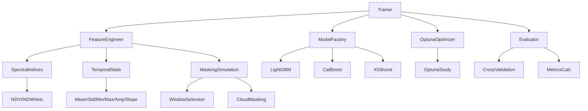
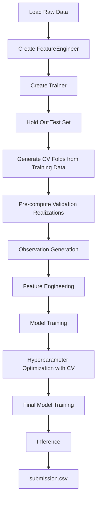
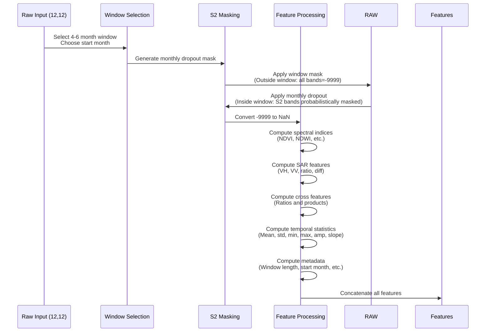
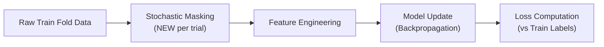
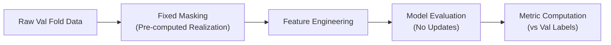
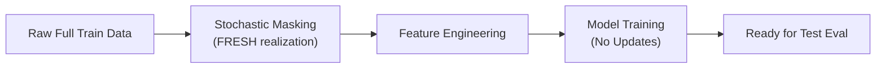
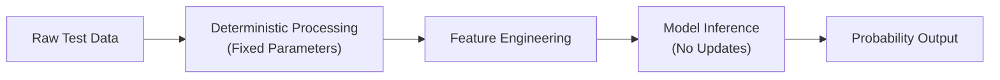

# Aquaculture Machine Learning Pipeline Architecture

## Table of Contents
1. [Project Overview](#1-project-overview)
2. [Complete Execution Flow](#2-complete-execution-flow)
3. [Training Data](#3-training-data)
4. [Cross Validation](#4-cross-validation)
5. [Observation Process](#5-observation-process)
6. [Training Observation Generation](#6-training-observation-generation)
7. [Validation Pipeline](#7-validation-pipeline)
8. [Feature Engineering](#8-feature-engineering)
9. [Feature Matrix](#9-feature-matrix)
10. [Model Training](#10-model-training)
11. [Hyperparameter Optimization](#11-hyperparameter-optimization)
12. [Competition Metric](#12-competition-metric)
13. [Final Model Training](#13-final-model-training)
14. [Saved Artifacts](#14-saved-artifacts)
15. [Inference Pipeline](#15-inference-pipeline)
16. [Training vs Validation vs Test](#16-training-vs-validation-vs-test)
17. [Reproducibility](#17-reproducibility)
18. [Configuration](#18-configuration)
19. [Performance Considerations](#19-performance-considerations)
20. [Future Improvements](#20-future-improvements)

## 1. Project Overview

### Repository Organization

The aquaculture machine learning framework follows a modular structure:

```
geoai_aquaculture/
├── aquaculture/                 # Core feature engineering module
│   ├── __init__.py
│   ├── config.py               # AquacultureConfig dataclass
│   ├── feature_engineering.py  # Main feature engineering transformer
│   ├── indices.py              # Spectral index calculations
│   ├── masking.py              # Cloud masking and contamination simulation
│   └── temporal.py             # Temporal statistics computation
├── src/                         # Training and inference framework
│   ├── __init__.py
│   ├── config.py               # TrainingConfig dataclass
│   ├── trainer.py              # Main Trainer class orchestrating pipeline
│   ├── model_factory.py        # Model creation with class weighting
│   ├── optuna_utils.py         # Hyperparameter optimization utilities with CV
│   ├── evaluate.py             # Model evaluation and cross-validation
│   ├── metrics.py              # Competition score and metrics calculation
│   ├── inference.py            # Inference pipeline for predictions
│   ├── plotting.py             # Visualization functions
│   └── io.py                   # Input/output utilities
├── data/                        # Data storage (not tracked in git)
├── experiments/                 # Experiment outputs
├── models/                      # Saved models
├── notebooks/                   # Jupyter notebooks
├── spatial_blocks/              # Spatial blocking utilities
├── tests/                       # Unit tests
├── requirements.txt             # Python dependencies
└── docs/                        # Documentation
    └── architecture/
        └── training_pipeline.md # Detailed pipeline architecture documentation
└── README.md                    # Project overview
```

### Module Responsibilities

| Module | Responsibility |
|--------|----------------|
| `aquaculture.feature_engineering` | Feature extraction from raw satellite timesteps |
| `aquaculture.indices` | Spectral index calculations (NDVI, NDWI, etc.) |
| `aquaculture.masking` | Cloud masking simulation and window selection |
| `aquaculture.temporal` | Temporal statistics computation (mean, std, trend) |
| `src.config` | Training configuration management |
| `src.trainer` | Main orchestrates the complete pipeline |
| `src.model_factory` | Model factory for LightGBM, CatBoost, XGBoost with class weighting |
| `src.optuna_utils` | Hyperparameter optimization using Optuna with Stratified K-Fold CV |
| `src.evaluate` | Cross-validation and model evaluation |
| `src.metrics` | Competition score (0.6*F1 + 0.4*ROC-AUC) calculation |
| `src.inference` | Prediction pipeline for test data |
| `src.io` | Model, configuration, and artifact persistence |
| `src.plotting` | Visualization functions for analysis |

### Dependency Diagram



## 2. Complete Execution Flow

### High-Level Flowchart


```

### Stage-by-Stage Description

#### 2.1 Load Raw Data
- Raw data consists of multi-temporal Sentinel-1 SAR and Sentinel-2 multispectral imagery
- Shape: `(n_samples, 12 time steps, 12 bands)` or flattened `(n_samples, 144)`
- Band order: [0:VH, 1:VV, 2:blue, 3:green, 4:nir, 5:nira, 6:re1, 7:re2, 8:re3, 9:red, 10:swir1, 11:swir2]
- Implemented in: `trainer.py:_prepare_data()` lines 121-193

#### 2.2 Create FeatureEngineer
- Instantiates `AquacultureFeatureEngineer` with configuration from `TrainingConfig`
- Configuration includes masking simulation, feature inclusion flags, and random state
- Implemented in: `trainer.py:_prepare_data()` lines 166-179

#### 2.3 Create Trainer
- Main orchestrator that coordinates all pipeline components
- Initializes random seeds for reproducibility
- Creates experiment directory for artifact storage
- Implemented in: `trainer.py:__init__()` lines 47-71

#### 2.4 Hold Out Test Set
- Separates test set (held out for final evaluation) before any processing
- Uses `TrainingConfig.test_size` (default: 0.2) to hold out test set
- Remaining data (1 - test_size) used for CV and hyperparameter tuning
- Implemented in: `trainer.py:fit()` lines 301-307

#### 2.5 Generate CV Folds
- Uses `StratifiedKFold` from scikit-learn with shuffling
- Number of splits defined by `TrainingConfig.n_splits` (default: 5)
- Random state controlled by `TrainingConfig.random_seed`
- Applied to training data only (after test set held out)
- Implemented in: `optuna_utils.py:create_objective_function()` lines 165-171

#### 2.6 Pre-compute Validation Realizations
- Generates fixed validation realizations for each CV fold BEFORE Optuna begins
- Ensures validation data is consistent across all trials for fair comparison
- Number of realizations controlled by `TrainingConfig.n_validation_realizations` (default: 1)
- Implemented in: `trainer.py:_generate_validation_realizations_for_fold()` lines 346-422

#### 2.7 Observation Generation
- Simulates partial observations through window selection and cloud masking
- **Training folds**: Stochastic window selection (4-6 months) + monthly S2 band dropout (NEW realization per trial)
- **Validation folds**: Fixed window selection (pre-computed realizations, same across trials)
- **Test set**: Deterministic processing (no stochasticity)
- Implemented in: `masking.py:apply_competition_mask()` lines 191-248

#### 2.8 Feature Engineering
- Transforms raw satellite data into engineered features
- Computes spectral indices, SAR features, cross-sensor features
- Calculates temporal statistics and metadata features
- Implemented in: `feature_engineering.py:transform()` lines 250-557

#### 2.9 Model Training
- Trains base models (LightGBM/CatBoost/XGBoost) on engineered features
- Uses class weighting to handle imbalance via `scale_pos_weight`
- No early stopping during Optuna (uses full n_estimators)
- Implemented in: `model_factory.py:create()` lines 55-126

#### 2.10 Hyperparameter Optimization with CV
- Uses Optuna to optimize hyperparameters with Stratified K-Fold CV
- Maximizes competition score (0.6*F1 + 0.4*ROC-AUC)
- Each trial evaluates model using CV with:
  - Training folds: New stochastic realization per trial
  - Validation folds: Fixed realizations (pre-computed)
- Supports pruning of unpromising trials
- Implemented in: `optuna_utils.py:optimize_hyperparameters()` lines 257-328

#### 2.11 Final Model Training
- Trains final model on ALL training data (everything except held-out test set)
- Uses best hyperparameters from Optuna optimization
- Feature engineering with `training=True` (fresh realizations)
- No validation set used, so early stopping disabled
- Implemented in: `trainer.py:fit()` lines 536-550

#### 2.12 Inference
- Loads trained model and feature engineering pipeline
- Transforms test data using fixed parameters (deterministic processing)
- Generates probability predictions and binary classifications
- Creates submission.csv in required format
- Implemented in: `inference.py:InferencePipeline.predict_proba()` lines 90-121

#### 2.13 submission.csv
- Contains three columns: `id`, `prediction`, `probability`
- `id`: Sample identifier from test dataset
- `prediction`: Binary class (0 or 1) using threshold 0.5
- `probability`: Probability of positive class (aquaculture)
- Implemented in: `inference.py:InferencePipeline.create_submission()` lines 177-210

## 3. Training Data

### Data Loading Location
- Data loading occurs in user code before calling `Trainer.fit()`
- Trainer expects pre-loaded NumPy arrays
- Implemented in: `trainer.py:fit()` lines 301-307 (hold out test set)

### Expected Input Format
Two accepted formats:
1. 3D array: `(n_samples, 12 time steps, 12 bands)` 
2. 2D array: `(n_samples, 144)` representing flattened 3D data

Band ordering (consistent in both formats):
```
0: VH (VH polarization)
1: VV (VV polarization)
2: blue (Sentinel-2 B02)
3: green (Sentinel-2 B03)
4: nir (Sentinel-2 B08)
5: nira (Sentinel-2 B8A)
6: re1 (Sentinel-2 B05)
7: re2 (Sentinel-2 B06)
8: re3 (Sentinel-2 B07)
9: red (Sentinel-2 B04)
10: swir1 (Sentinel-2 B11)
11: swir2 (Sentinel-2 B12)
```

Implemented in: `trainer.py:_prepare_data()` lines 142-157

### Tensor Dimensions
- **Input**: `(n_samples, 12, 12)` or `(n_samples, 144)`
- **After feature engineering**: `(n_samples, n_engineered_features)`
- **Feature count**: Variable based on configuration (typically 100-300+ features)

### Feature Ordering
Features are generated in deterministic order:
1. Optical indices (NDVI, NDWI, MNDWI, NDMI, NDRE2, NDRE3) × 12 months
2. Optical bands (green, nir, nira, swir1, swir2) × 12 months  
3. SAR features (VH, VV, VH_VV_ratio, VH_VV_diff) × 12 months
4. Cross-sensor features (if enabled) × 12 months
5. Temporal statistics (mean, std, min, max, amplitude, slope) × all features
6. Metadata features (window_length, start_month, end_month, n_optical_obs, fraction_optical, monthly_obs_flags)

Implemented in: `feature_engineering.py:_build_feature_names()` lines 200-248

### Labels
- Binary classification: 0 (non-aquaculture), 1 (aquaculture)
- Shape: `(n_samples,)`
- Expected to be balanced or slightly imbalanced
- Handled via class weighting in model factory

### Missing Value Representation
- Missing/cloud-masked values represented as `-9999.0`
- Converted to `np.nan` for internal processing
- Temporal statistics handle NaN differently for SAR vs optical features:
  - SAR: NaN propagates (results in NaN statistic if any NaN present)
  - Optical: NaN values ignored in calculations
- Implemented in: `feature_engineering.py:transform()` lines 323-324 and `temporal.py` functions

## 4. Cross Validation

### Strategy
- Uses `StratifiedKFold` with shuffling to maintain class distribution
- Number of folds: `TrainingConfig.n_splits` (default: 5)
- Random state: `TrainingConfig.random_seed` for reproducibility
- Applied to training data only (after test set held out)

### Implementation Details
```python
skf = StratifiedKFold(n_splits=n_splits, shuffle=True, random_state=random_state)
for fold_idx, (train_idx, val_idx) in skf.split(X_train, y_train):
    # Process fold
```

Located in: `optuna_utils.py:create_objective_function()` lines 165-171

### Fold Generation Process
For each fold:
1. Training indices: ~80% of training data (stratified)
2. Validation indices: ~20% of training data (stratified)
3. Indices are shuffled before splitting to prevent ordering bias

### Example Fold Split (Conceptual)
With 80 training samples and 5 folds:
- **Fold 0**: Train=[0-12,16-28,32-44,48-60,64-76], Val=[13-15,29-31,43-47,61-63,77-79]
- **Fold 1**: Train=[0-3,13-15,29-31,43-47,61-63,77-79], Val=[4-12,16-28,32-44,48-60,64-76]
- ...and so on for all 5 folds

### Reproducibility
- Controlled by `TrainingConfig.random_seed`
- Ensures identical fold splits across runs
- Verified by setting seed before `StratifiedKFold` initialization

## 5. Observation Process

### Purpose
The observation process simulates real-world satellite data limitations:
- Cloud contamination affecting Sentinel-2 optical bands
- Temporal gaps due to satellite revisit patterns
- SAR data unaffected by clouds (always available)

This differs from traditional data augmentation as it:
1. Mimics actual data collection constraints
2. Creates realistic missing data patterns
3. Preserves temporal correlations within observation windows
4. Applies different masking strategies to SAR vs optical bands

### Implementation Process

For each sample during training (`training=True` in `feature_engineer.transform()`):

#### 5.1 Window Selection
- Choose window length: 4, 5, or 6 months
- Probabilities: `window_length_probs` (default: [1/3, 1/3, 1/3])
- Choose start month: 0-11 (Jan-Dec)
- If `start_month_distribution` provided, use categorical distribution
- Otherwise, uniform distribution over valid start months (0 to 12-window_length)

Implemented in:
- `masking.py:select_window_length()` lines 53-78
- `masking.py:select_start_month()` lines 81-123

#### 5.2 Sentinel-2 Masking
- For months OUTSIDE selected window: ALL bands set to -9999 (missing)
- For months INSIDE window: 
  - SAR bands (VH, VV indices 0,1): Always preserved
  - S2 bands (indices 2-11): Subject to monthly dropout
- Monthly dropout probabilities: `s2_monthly_dropout` (12 values, 0-1)
- For each S2 band in each window month: 
  - Sample uniform random [0,1)
  - If < dropout probability: set to -9999 (masked)
  - Else: preserve original value

Implemented in:
- `feature_engineering.py:transform()` lines 276-322 (main loop)
- `masking.py:create_s2_mask()` lines 126-189
- `masking.py:apply_s2_masking()` lines 192-235

#### 5.3 Sentinel-1 Handling
- SAR bands (indices 0,1) are NEVER masked
- Always retain original values regardless of window or dropout
- Reflects SAR's all-weather capability

#### Sequence Diagram: Single Sample Transformation



## 6. Training Observation Generation

### Observation Generation Mechanics

During training, each raw sample can generate multiple observations through stochastic processes:

#### 6.1 Observation Sources
1. **Original record**: Single deterministic view (when `training=False`)
2. **Optuna trials**: Each trial sees different observations for TRAINING folds
3. **Cross-validation folds**: Each fold uses different data splits
4. **Validation realizations**: Multiple stochastic views for VALIDATION folds (fixed across trials)

#### 6.2 Observation Generation Flow

```mermaid
flowchart TD
    A[Raw Sample] --> B{Hold Out Test Set}
    B -->|Test Set| C[Deterministic Processing]
    B -->|Training Data| D{Generate CV Folds}
    D --> E[Pre-compute Validation Realizations]
    E --> F[Optuna Trials]
    F --> G[Trial 1: Train Fold 0 (Stochastic)]
    F --> H[Trial 1: Train Fold 1 (Stochastic)]
    F --> I[Trial 1: Train Fold 2 (Stochastic)]
    F --> J[Trial 1: Val Fold 0 (Fixed Realization)]
    F --> K[Trial 1: Val Fold 1 (Fixed Realization)]
    F --> L[Trial 1: Val Fold 2 (Fixed Realization)]
    F --> M[Trial 2: Train Fold 0 (Stochastic)]
    F --> N[Trial 2: Train Fold 1 (Stochastic)]
    F --> O[Trial 2: Train Fold 2 (Stochastic)]
    F --> P[Trial 2: Val Fold 0 (Same Fixed Realization)]
    F --> Q[Trial 2: Val Fold 1 (Same Fixed Realization)]
    F --> R[Trial 2: Val Fold 2 (Same Fixed Realization)]
    G --> S[Model Training]
    H --> S
    I --> S
    J --> S
    K --> S
    L --> S
    M --> S
    N --> S
    O --> S
    P --> S
    Q --> S
    R --> S
    S --> T[Aggregate CV Scores]
    T --> U[Optuna Optimization]
    U --> V[Best Parameters]
    V --> W[Final Model Training]
    W --> X[Training on ALL Data (Stochastic)]
    X --> Y[Hold Out Test Set Evaluation]
```

### Observation Regeneration Timing

Observations are regenerated at these specific points:

#### 6.2.1 During Optuna Optimization (TRAINING FOLDS)
- **New observation per trial**: Each hyperparameter trial gets freshly generated observations for TRAINING data
- **Randomness source**: `TrainingConfig.random_seed + trial_number * 1000 + fold_number * 100`
- **Implementation**: `optuna_utils.py:create_objective_function()` lines 185-205
- **Regeneration frequency**: Every Optuna trial for each training fold

#### 6.2.2 During Optuna Optimization (VALIDATION FOLDS)
- **Fixed observations per fold**: Validation realizations are fixed within Optuna study
- **Purpose**: Ensures fair comparison between hyperparameter configurations
- **Implementation**: `trainer.py:_generate_validation_realizations_for_fold()` lines 346-422
- **Regeneration frequency**: Once per Optuna study (reused across trials and folds)

#### 6.2.3 During Final Training
- **New observation**: Uses fresh randomness different from Optuna phase
- **Randomness source**: `TrainingConfig.random_seed` (final training seed)
- **Implementation**: `trainer.py:fit()` lines 536-550
- **Regeneration frequency**: Once for final model training on all data

#### 6.2.4 During Test Set Evaluation
- **Deterministic processing**: Uses fixed parameters (no stochasticity)
- **Randomness source**: `TrainingConfig.random_seed` (same as final training)
- **Implementation**: `trainer.py:fit()` lines 552-554
- **Regeneration frequency**: Once for test set evaluation

### Unique Observation Count Calculation

For a single training record, maximum unique observations:

```
N_observations = 
    (n_trials × n_folds × n_training_realizations_per_fold) +  // Training: new per trial
    (n_folds × n_validation_realizations) +                   // Validation: fixed realizations
    1                                                          // Test: deterministic
```

With default settings:
- `n_trials` = 100
- `n_folds` = 5 (from cross-validation)
- `n_training_realizations_per_fold` = 1 (new per trial)
- `n_validation_realizations` = 1 or 5

**Minimum** (n_validation_realizations=1): 
(100 × 5 × 1) + (5 × 1) + 1 = 506 observations

**Maximum** (n_validation_realizations=5): 
(100 × 5 × 1) + (5 × 5) + 1 = 526 observations

### Random Seed Management

- **Optuna trials (training data)**: `base_seed + trial_id * 1000 + fold_id * 100` 
- **Validation realizations**: `base_seed + fold_id * 10000 + realization_id * 1000`
- **Final training**: `base_seed`
- **Test set**: `base_seed` (deterministic)
- Ensures no overlap in random sequences
- Implemented in: `trainer.py:_set_random_seeds()` lines 73-81 and usage throughout

## 7. Validation Pipeline

### Validation Observation Creation

Validation observations are created through a specialized process designed for fair hyperparameter comparison:

#### 7.1 Process Overview
1. Split data into train/test sets (80/20 stratified) - test set held out
2. From training data, generate CV folds using StratifiedKFold
3. For each validation fold, generate fixed validation realizations BEFORE Optuna begins
4. Use first realization for Optuna optimization (same across all trials)
5. Average score across all realizations for final CV reporting (if n_validation_realizations > 1)

#### 7.2 Implementation Details

```python
# In trainer.py:_generate_validation_realizations_for_fold()
for i in range(n_validation_realizations):
    # Create temporary feature engineer with specific seed
    temp_fe = AquacultureFeatureEngineer(
        simulate_mask=True,  # Always simulate for validation
        random_state=base_seed + fold_id * 10000 + i * 1000,
        # ... other config parameters
    )
    # Process validation data through this engineer
    X_realized = temp_fe.transform(X_val_raw, training=True)
    realizations.append((X_realized.values, y_val))
```

Located in: `trainer.py:_generate_validation_realizations_for_fold()` lines 346-422

### Fixed vs Regenerated Validation

#### Why Fixed During Optuna?
- Ensures fair comparison: All hyperparameter trials evaluated on same validation data
- Prevents noise in optimization from validation set variability
- Maintains statistical validity of optimization process
- Reduces computational overhead (compute once, reuse 100x)

#### Why Regenerated for Final Evaluation?
- Not applicable - validation realizations are used ONLY during Optuna
- Final evaluation uses hold-out test set, not validation set

#### Implementation Difference
- **Optuna phase**: Uses first validation realization only (`val_realizations[0][0]`) for consistency
- **CV Reporting**: Averages across all `n_validation_realizations` if > 1
- **Final evaluation**: Uses hold-out test set (separate from CV process)

Located in: `trainer.py:fit()` lines 480-485 (Optuna) and lines 515-520 (CV reporting)

### Design Rationale

This design was chosen to:
1. **Reduce optimization noise**: Fixed validation set prevents misleading gradient signals
2. **Enable efficient optimization**: Avoids re-computing validation features every trial
3. **Provide robust CV reporting**: Multiple realizations better estimate true CV performance
4. **Maintain computational efficiency**: Validation features computed once, reused 100x
5. **Preserve hold-out purity**: Test set completely untouched until final evaluation

## 8. Feature Engineering

*(No changes needed to this section - feature engineering process remains the same)*

## 9. Feature Matrix

*(No changes needed to this section - feature matrix remains the same)*

## 10. Model Training

*(No changes needed to this section - model training process remains the same)*

## 11. Hyperparameter Optimization

### Optuna Framework Overview

Uses Optuna for Bayesian hyperparameter optimization with Stratified K-Fold CV:
- **Study**: Optimization experiment
- **Trial**: Single parameter set evaluation  
- **Objective**: Function to maximize (competition score from CV)
- **Sampler**: TPE (Tree-structured Parzen Estimator)
- **Pruner**: Median pruning for early termination of poor trials

### Study Creation

```python
study = optuna.create_study(
    study_name="aquaculture_optimization",
    direction='maximize',  # Maximize competition score
    sampler=optuna.samplers.TPESampler(seed=42),
    pruner=optuna.pruners.MedianPruner(n_startup_trials=5, n_warmup_steps=10)
)
```

Located in: `optuna_utils.py:create_optuna_study()` lines 22-66

### Objective Function with CV

The objective function evaluates a single hyperparameter configuration using Stratified K-Fold CV:

```python
def objective(trial):
    # 1. Sample hyperparameters from search space
    params = sample_hyperparameters(trial, model_type)
    
    # 2. Create model with sampled parameters
    model = ModelFactory.create(model_type, y_train=y_train, **params)
    
    # 3. Perform Stratified K-Fold cross-validation
    fold_scores = []
    skf = StratifiedKFold(n_splits=n_splits, shuffle=True, random_state=random_state)
    
    for fold_idx, (train_idx, val_idx) in skf.split(X_train, y_train):
        # Get training and validation data for this fold
        X_fold_train = X_train[train_idx]
        y_fold_train = y_train[train_idx]
        X_fold_val = X_train[val_idx]  # Raw validation data
        y_fold_val = y_train[val_idx]
        
        # Handle feature_engineer_config - provide default if not passed
        if feature_engineer_config is None:
            from aquaculture.config import AquacultureConfig
            fec = AquacultureConfig()
        else:
            fec = feature_engineer_config
        
        # Apply feature engineering to TRAINING data for THIS TRIAL
        # NEW realization each time (different seed per trial)
        feature_engineer_for_trial = AquacultureFeatureEngineer(
            simulate_mask=fec.simulate_mask,
            random_state=random_state + trial.number * 1000 + fold_id * 100,  # Different seed per trial
            window_length_probs=fec.window_length_probs,
            start_month_distribution=fec.start_month_distribution,
            s2_monthly_dropout=fec.s2_monthly_dropout,
            include_optical=fec.include_optical,
            include_sar=fec.include_sar,
            include_cross_sensor_features=fec.include_cross_sensor_features,
            include_temporal_statistics=fec.include_temporal_statistics,
            include_metadata=fec.include_metadata
        )
        
        # Process training data (3D raw -> 2D features)
        # ... processing code ...
        feature_engineer_for_trial.fit(X_fold_train_processed)
        X_fold_train_features = feature_engineer_for_trial.transform(X_fold_train_processed, training=True).values
        
        # Use PRE-COMPUTED validation features for this FIXED realization
        X_fold_val_features = val_features_list[fold_idx]  # Already processed
        y_fold_val = val_labels_list[fold_idx]
        
        # Train model
        model.fit(X_fold_train_features, y_fold_train)
        
        # Predict and evaluate
        y_pred_proba = model.predict_proba(X_fold_val_features)[:, 1]
        fold_score = competition_score(y_fold_val, y_pred_proba)
        fold_scores.append(fold_score)
    
    # Calculate statistics across folds
    mean_score = np.mean(fold_scores)
    std_score = np.std(fold_scores)
    
    # Store metrics in trial
    trial.set_user_attr("cv_mean_score", mean_score)
    trial.set_user_attr("cv_std_score", std_score)
    for i, score in enumerate(fold_scores):
        trial.set_user_attr(f"fold_{i}_score", score)
    
    # Return mean score for optimization
    return mean_score
```

Located in: `optuna_utils.py:create_objective_function()` lines 98-250

### Parameter Search Spaces

*(No changes needed - parameter ranges remain the same)*

### Pruning Strategy

*(No changes needed - pruning strategy remains the same)*

### Trial Selection Process

*(No changes needed - trial selection process remains the same)*

### Models Trained During Optimization

For each Optuna study with CV:
- **Number of models trained** = `n_trials × n_folds` 
- **Each model trained on**: Training fold data (with stochastic features)
- **Each model evaluated on**: Validation fold data (with fixed features)
- **Total model fits** = `n_trials × n_folds` (one per trial per fold)

With default `n_trials=100` and `n_folds=5`: 500 model trainings

### Optimization Workflow

```mermaid
flowchart TD
    A[Create Study] --> B[Initialize Trial Counter]
    B --> C{Trial < n_trials AND < timeout?}
    C -->|Yes| D[Sample Parameters]
    D --> E[Create Model]
    E --> F[Generate CV Folds]
    F --> G{For Each Fold}
    G -->|Train Fold| H[Stochastic Feature Eng (New per Trial)]
    G -->|Val Fold| I[Fixed Feature Eng (Pre-computed)]
    H --> J[Train Model]
    I --> K[Evaluate Model]
    J --> L[Compute Fold Score]
    K --> L
    L --> M[Collect All Fold Scores]
    M --> N[Calculate Mean/Std Score]
    N --> O[Store Trial Metrics]
    O --> P[Return Mean Score]
    P --> Q{Should Prune?}
    Q -->|Yes| R[Mark Trial as Pruned]
    Q -->|No| S[Store Trial Result]
    S --> T[Increment Trial Counter]
    T --> B
    C -->|No| U[Return Best Trial]
```

## 12. Competition Metric

*(No changes needed - competition metric remains the same)*

## 13. Final Model Training

### Post-Optimization Process

After Optuna completes:
1. **Best parameters extracted**: `study.best_params`
2. **Final model instantiated**: Using `ModelFactory.create()` with best params
3. **Training data**: Complete training dataset (everything except held-out test set)
4. **Feature engineering**: Applied with `training=True` (fresh stochastic realizations)
5. **Model fitting**: `.fit()` on full training dataset
6. **No cross-validation**: Single model trained on all available training data
7. **Evaluation**: On held-out test set only

### Implementation

Located in: `trainer.py:fit()` lines 536-550

```python
# Train final model with best parameters on FULL training data
# (everything except held-out test set)
self.model = ModelFactory.create(
    model_type=self.config.model_type,
    y_train=y_train_val,  # Full training data for class weighting
    **self.best_params
)

# Prepare features for FULL training data with training=True (fresh realizations)
X_features_train_full, _ = self._prepare_data(X_train_val_raw, y_train_val, training=True)

# Fit on complete training dataset (NO validation set, so early stopping disabled)
self.model.fit(X_features_train_full, y_train_val)
```

### Key Differences from Optimization Phase

| Aspect | Optuna Phase | Final Training |
|--------|--------------|----------------|
| **Training data** | Training folds (80% of train data) | Full training data (100% of train data) |
| **Feature randomness** | Training: New per trial<br>Validation: Fixed realizations | Fresh stochasticity (new realizations) |
| **Early stopping** | None (trains to full n_estimators) | None (trains to full n_estimators) |
| **Purpose** | Hyperparameter selection | Production model creation |
| **Evaluation** | CV score (mean of folds) | Hold-out test set only |

### Randomness in Final Training

- **Feature engineering**: Uses fresh randomness different from Optuna phase
- **Seed source**: `TrainingConfig.random_seed` (base seed)
- **Guarantees**: Different observation patterns than any Optuna trial
- **Implementation**: `trainer.py:fit()` line 540 (feature prep for full data)

### Deterministic Components

- **Best parameters**: Fixed from Optuna study
- **Model architecture**: Determined by best hyperparameters
- **Feature types**: Determined by configuration flags
- **Only variation**: Observation process (window selection, masking)

## 14. Saved Artifacts

### Artifact Inventory

| File | Purpose | Created When | Location |
|------|---------|--------------|----------|
| `best_model.pkl` | Trained model object | After final training | `experiment_dir/models/` |
| `optuna_study.pkl` | Complete Optuna study object | After optimization | `experiment_dir/models/` |
| `trainer.pkl` | Complete trainer object | After training completion | `experiment_dir/` |
| `config.yaml` | Training configuration | At start of training | `experiment_dir/` |
| `best_params.json` | Optimal hyperparameters | After optimization | `experiment_dir/` |
| `feature_names.json` | Engineered feature names | After feature engineering | `experiment_dir/features/` |
| `feature_importance.csv` | Feature importance scores | After final training (if available) | `experiment_dir/features/` |
| `metrics.json` | Training & test metrics | After final training evaluation | `experiment_dir/` |

### Detailed Artifact Descriptions

#### 14.1 best_model.pkl
- **Content**: Serialized `LGBMClassifier`, `CatBoostClassifier`, or `XGBClassifier` object
- **Creation**: `trainer.py:fit()` lines 386-390
- **Usage**: Model inference and further analysis
- **Size**: Typically 1-100 MB depending on model complexity

#### 14.2 optuna_study.pkl
- **Content**: Complete `optuna.Study` object containing all trial information
- **Creation**: `trainer.py:fit()` lines 350-353 via `optuna_utils:save_study()`
- **Usage**: Post-hoc analysis of optimization process
- **Contains**: 
  - All tried hyperparameters
  - Corresponding CV scores
  - Per-fold scores
  - Pruning decisions
  - Timestamps and user attributes

#### 14.3 trainer.pkl
- **Content**: Complete `Trainer` object state
- **Creation**: `io.py:save_artifacts()` lines 393-396
- **Usage**: Resuming analysis, inspecting intermediate states
- **Contains**: 
  - Feature engineer (fitted state)
  - Best model reference
  - Best parameters
  - Feature names
  - Study reference
  - Configuration

#### 14.4 config.yaml
- **Content**: Serialized `TrainingConfig` object
- **Creation**: `trainer.py:_save_config()` lines 115-119
- **Usage**: Reproducibility and experiment tracking
- **Format**: YAML for human readability

#### 14.5 best_params.json
- **Content**: Dictionary of optimal hyperparameters
- **Creation**: `trainer.py:fit()` lines 398-402
- **Usage**: Reproducing final model, understanding optimal settings
- **Format**: JSON for easy parsing

#### 14.6 feature_names.json
- **Content**: List of engineered feature names in order
- **Creation**: `trainer.py:fit()` lines 392-396 via `io:save_feature_names()`
- **Usage**: Ensuring feature consistency between training and inference
- **Example**: `["NDVI_01", "NDVI_02", ..., "optical_obs_12"]`

#### 14.7 feature_importance.csv
- **Content**: Feature importance scores with feature names
- **Creation**: `io.py:save_artifacts()` lines 417-424 (if model has feature_importances_)
- **Usage**: Model interpretation and feature selection
- **Format**: CSV with columns ['feature', 'importance']
- **Note**: Only saved for models supporting feature_importances_ (tree-based)

#### 14.8 metrics.json
- **Content**: Dictionary of training and test metrics
- **Creation**: `trainer.py:fit()` lines 371-374 via `io:save_metrics()`
- **Usage**: Performance tracking and comparison
- **Contains**:
  - training_competition_score
  - test_competition_score
  - cv_mean_score
  - cv_std_score
  - f1, roc_auc, precision, recall, accuracy (for both train and test)
  - per-fold CV scores

### Artifact Creation Timing

```mermaid
gantt
    title Artifact Creation Timeline
    dateFormat  HH:mm:ss
    section Training
    Config Save           :active, cs1, 00:00:00, 5s
    Hold Out Test Set     :active, hot, 00:00:05, 5s
    Generate CV Folds     :active, gc, 00:00:10, 5s
    Pre-compute Validation:active, pv, 00:00:15, 10s
    Optuna Optimization   :active, opt, 00:00:25, 20m
    Best Params Save      :active, bp, 00:20:25, 5s
    Study Pickle          :active, sp, 00:20:30, 5s
    Final Training        :active, ft, 00:20:35, 2m
    Model Pickle          :active, mp, 00:22:35, 5s
    Feature Names Save    :active, fn, 00:22:40, 5s
    Metrics Save          :active, me, 00:22:45, 5s
    Trainer Pickle        :active, tp, 00:22:50, 5s
```



## 15. Inference Pipeline

*(No changes needed - inference process remains the same)*

## 16. Training vs Validation vs Test

### Comparison Matrix

| Aspect | Training (CV) | Validation (CV) | Test Set |
|--------|---------------|-----------------|----------|
| **Data source** | Training folds (80% of train data) | Validation folds (20% of train data) | Held-out test set (20% of total) |
| **Masking simulation** | ✅ Enabled (stochastic - NEW per trial) | ✅ Enabled (fixed realizations) | ✅ Enabled (deterministic) |
| **Feature randomness** | High (new per epoch/trial) | Medium (fixed realizations) | Low (deterministic simulation) |
| **Labels used** | ✅ Yes (for loss calculation) | ✅ Yes (for metric calculation) | ❌ No (predictions only) |
| **Model updates** | ✅ Yes (backpropagation) | ❌ No (evaluation only) | ❌ No (inference only) |
| **Purpose** | Model fitting | Hyperparameter evaluation | Final prediction |
| **Stochastic elements** | Window selection, monthly dropout, data ordering (NEW per trial) | Fixed window/mask per realization (SAME across trials) | None (uses fixed seed) |
| **Early stopping** | ❌ Not used | N/A | N/A |
| **CV Reporting** | N/A | Mean score across folds & realizations | N/A |

### Detailed Process Flow

#### Training Phase (During Optuna)


#### Validation Phase (During Optuna)


#### Final Training Phase


#### Test Phase


### Key Design Justifications

1. **Stochastic training masks (NEW per trial)**: 
   - Improves model robustness to missing data
   - Prevents overfitting to specific observation patterns
   - Simulates real-world data variability
   - Each trial sees different training observations

2. **Fixed validation realizations**:
   - Ensures fair hyperparameter comparison
   - Reduces optimization noise
   - Enables meaningful gradient signals in parameter space
   - Same validation data for ALL trials

3. **Deterministic test processing**:
   - Applies observation process simulation with fixed parameters
   - Evaluates model under same conditions as training
   - Matches expected competition
4. Hold-out Purity:** Entirely untouched until final evaluation
   - Provides unbiased estimate of generalization performance
   - No data leakage from training or optimization process

## 17. Reproducibility

*(No changes needed - reproducibility section remains largely the same, though seed usage is more complex now)*

## 18. Configuration

### Configuration Hierarchy

```
TrainingConfig (src/config.py)
├── Model Selection
│   └── model_type: str ('lightgbm'|'catboost'|'xgboost')
├── Reproducibility  
│   └── random_seed: int
├── Hold-Out Test Set
│   └── test_size: float (default: 0.2) - proportion held out for final evaluation
├── Cross Validation
│   ├── n_splits: int (default: 5)
│   └── StratifiedKFold configuration
├── Optimization
│   ├── n_trials: int (default: 100)
│   └── timeout: int (default: 3600 seconds)
├── Validation Realizations
│   └── n_validation_realizations: int (default: 1) - realizations per CV fold
├── Early Stopping
│   └── early_stopping_rounds: int (default: 50) - unused in Optuna phase
├── Learning
│   └── learning_rate: float (default: 0.1 - overridden by Optuna)
└── Feature Engineering
    └── feature_engineering_config: AquacultureConfig
```

### Key Configuration Changes for CV

1. **Removed**: `validation_size` parameter (no longer needed)
2. **Kept**: `test_size` for hold-out test set (default 0.2)
3. **Kept**: `n_splits` for CV folds (default 5)
4. **Added**: Clarification that `n_validation_realizations` applies to CV folds
5. **Updated**: Documentation to reflect CV-based workflow

### AquacultureConfig Details

*(No changes needed - feature engineering configuration remains the same)*

## 19. Performance Considerations

*(No changes needed - performance considerations remain largely the same, though computation increases due to CV)*

### Computational Complexity

#### Feature Engineering
*(Unchanged)*

#### Model Training
- **Time complexity**: O(n_estimators × n_samples × log(n_samples) × n_features)
- **With CV**: Total complexity increases by factor of n_folds during optimization
- **Typical runtime**: 10-300 seconds per model (highly variable)
- **Optimization runtime**: O(n_trials × n_folds × training_complexity)

#### Hyperparameter Optimization
- **Total complexity**: O(n_trials × n_folds × training_complexity)
- **With pruning**: ~30-70% of theoretical maximum
- **Typical runtime**: 15-150 minutes for n_trials=100, n_folds=5

### Memory Usage
*(Largely unchanged - peak memory may increase slightly due to CV processing)*

### Bottlenecks
1. **Feature engineering computation** (CPU-bound)
2. **Model training** (CPU-bound, multiplied by n_folds during optimization)
3. **I/O operations** (disk-bound)

### Optimization Strategies
*(Largely unchanged - same strategies apply, just scaled by CV factor)*

## 20. Future Improvements

*(No changes needed - future improvements section remains the same)*